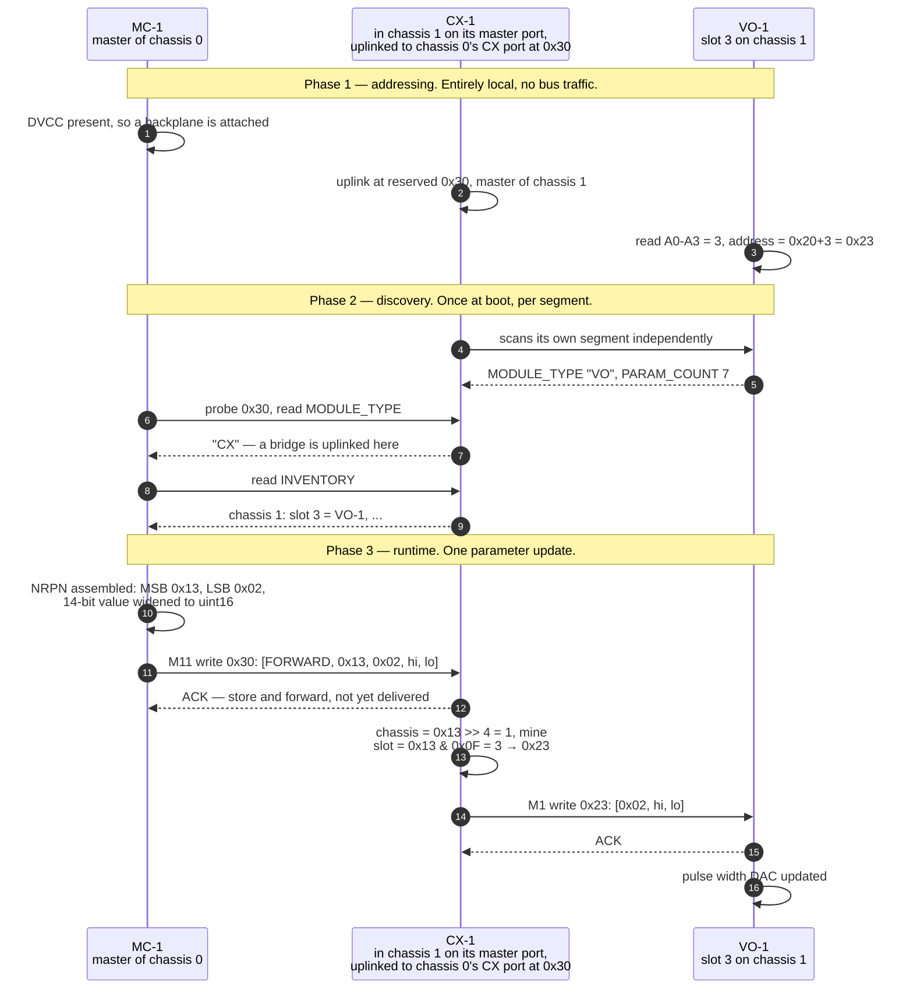
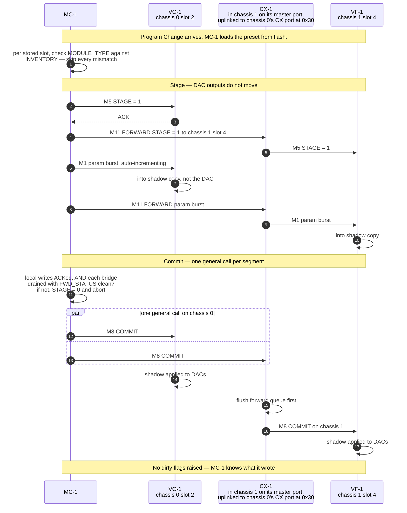
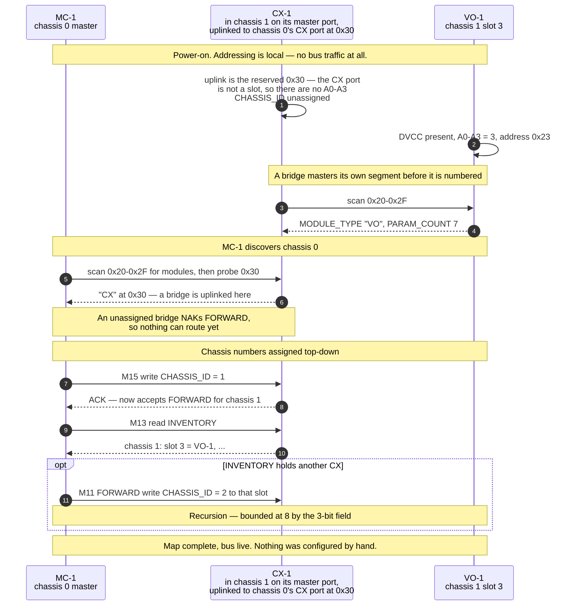

# FluxTron Inter-Module Bus Protocol

The digital backplane that carries parameter values between modules. Referenced
from `CLAUDE.md`; this file is the normative description.

Layered from the bottom up: **physical** (§2), **electrical** (§3),
**addressing** (§4), **link** (§5), **logical** (§6), with bridging (§7) and
the MIDI mapping (§8) on top. A bridge appears at several layers and is
cross-referenced from each rather than described in one blob.

MC-1 is the master of chassis 0. Each further chassis is mastered by its own
CX-1 bridge; every other module is a slave. Only *parameter values* travel
here — see the invariant below.

---

## 1. Scope and the governing invariant

> **The bus may carry anything where tens of milliseconds of worst-case
> delivery latency is merely undesirable. It may never carry anything where
> that would be musically wrong.**

Pitch, gate, velocity, clock and audio stay on patch cables. That is what makes
a non-deterministic, clock-stretchable I2C link acceptable as the parameter
transport. Two reasons, and the second is the one people miss:

- **Latency is unbounded in the tail.** A normal transaction is ~400µs at
  100kHz, and worst case behind a burst is ~2ms. But an STM32 slave stretches
  SCL whenever it cannot service the peripheral, and a module writing its
  settings page stalls the CPU for **tens of milliseconds** during flash erase,
  because it is executing from the flash it is erasing. One module saving its
  MIDI channel would halt the entire bus.
- **A wire holds state; a bus carries events.** A gate on a patch cable cannot
  be "lost" — the voltage *is* the state. A note-on/note-off pair is two
  events, and a dropped note-off is a note that sustains forever. Recovering
  that needs retries, acknowledgements and an all-notes-off watchdog, all to
  recreate a property copper has for free.

**Note *number* as information is fine** — telling a module the current note so
it can display it, key-track slowly, or report to a host. It is the
*triggering* role that is forbidden, not the data.

**If a cable-free gate is ever wanted**, the standard Eurorack 16-pin bus
already carries CV and Gate lines, which PS-1's bus board routes. That is
analogue and deterministic. It is a single global pair, so mono only — **and
per segment**: those lines stop at the chassis boundary. See §2.7 for reaching
another chassis.

---

## 2. Physical layer

### 2.1 Topology

One **segment** per chassis: a passive bus board carrying a master port, up to
16 numbered slave slots, and optionally one CX port for chaining downstream.
Segments form a **daisy chain**, never a tree (§7.4).

| Role | Seats in | Connects via |
|---|---|---|
| **MC-1** | Chassis 0, any 8HP position | Master port |
| **Slave module** | Any 8HP position | A numbered slot |
| **CX-1 bridge** | The chassis it *brings onto* the bus | Master port locally; uplink cable to the parent's CX port |

N chassis needs N × PS-1 and (N−1) × CX-1. Chassis 0 holds MC-1 and PS-1;
every chassis after it holds PS-1 and CX-1, so **the cost of expansion lands in
the new case, not the existing one**.

### 2.2 Connectors

Four distinct formats. **Every pin count differs, so no two can be
cross-plugged** — the mechanical reasoning behind §2.5 extended to the whole
set.

| Connector | Format | Between |
|---|---|---|
| **Power** | 2×8 (16-pin) on every module | Every module ↔ bus board. 16-pin because every module's 3.3V LDO runs from +5V. Range-wide, see `CLAUDE.md` |
| **Module bus** | **2×6 (12-pin)** | Slave module ↔ a numbered slot |
| **Master port** | **2×4 (8-pin)** | MC-1 or CX-1 ↔ the bus board's master port |
| **Uplink** | **RJ45 / Cat5** | CX-1's panel ↔ the parent bus board's CX port |

### 2.3 Pinouts

**Module bus — 2×6**

| Pin | Signal | Notes |
|---|---|---|
| 1 | DVCC | Pull-up reference, **not** a module supply. §3.2 |
| 2 | GND | |
| 3 | SDA | |
| 4 | SCL | |
| 5 | nRESET | Master-driven, open-drain. §6.5 |
| 6 | ATTN | Slave-driven, open-drain, wired-OR. §6.3 |
| 7–10 | A0–A3 | Slot address, driven by the backplane. §4.2 |
| 11–12 | *spare* | Reserved |

**Master port — 2×4**

Same signals minus the slot address, which a master has no use for. The
narrower shell stops a slave module being plugged in here, and stops a master
module being plugged into a numbered slot.

| Pin | Signal |
|---|---|
| 1 | DVCC |
| 2 | GND |
| 3 | SDA |
| 4 | SCL |
| 5 | nRESET |
| 6 | ATTN |
| 7–8 | *spare* |

### 2.4 The CX port and the uplink cable

The parent end of an inter-chassis link is a **dedicated CX port on the bus
board** — a PCA9615 and an RJ45 — not a module position.

**A buffered link needs a transceiver at both ends**, so that hardware exists
whichever chassis the bridge module is seated in. Given it is unavoidable,
building it into the backplane means the link consumes no backplane position
that could otherwise hold a module. That is also why the uplink takes a
reserved address rather than a slot number (§4.4).

| End | Hardware |
|---|---|
| **Child chassis** | CX-1's local port into that bus board's **master port** |
| **Parent chassis** | The bus board's **CX port**, through which CX-1 appears at `0x30` |

- **The PCA9615 needs no level translation.** It carries *two* supply pins,
  `VDD(A)` for the single-ended side and `VDD(B)` for the differential side.
  `VDD(B)` runs 3.0–5.5V, is 5.5V tolerant, and the datasheet gives **best
  operation at 5V**. The split supply also makes it an inherent level
  translator, so the CX port is independent of whatever DVCC is set to.
  *(An earlier revision called this part "3.3V-class" and counted level
  translation as a cost of the 5V decision. That was asserted from memory and
  is wrong.)*
- The cable carries **differential I2C, a differential CV pair and a gate
  (§2.7), plus a ground reference — never power**.
- **⚠️ The inter-chassis ground is a parallel path.** Two cases with separate
  bricks are already bonded through the shields of any patch cables running
  between them, so the link's ground adds a loop — and audio *will* run
  between those cases. Galvanic isolation would break it but needs an isolated
  supply on one side. Decide before the link is designed, not after.
- **RJ45/Cat5 is right electrically** — two real twisted pairs — and
  industrial against a matte-black etched panel. A genuine tension at panel
  design.

### 2.5 ⚠️ Never a 10-pin bus connector

Ten signals tempts a 2×5 header — the same family as the Eurorack power
header, same ribbon, same crimp tooling. **A 10-pin socket mates with a 16-pin
shrouded power header by design**, that being ordinary Eurorack practice, so a
10-pin bus plug would go straight onto ±12V and destroy every MCU on the
backplane. The hazard is not that the two look alike; it is that the smaller
one *fits*. 2×6 does not, and the two spare pins cost nothing now and are
impossible to add later.

### 2.6 Where CX-1 physically lives

**CX-1 lives in the chassis it brings onto the bus**, in an ordinary 8HP
position, powered by that chassis's PS-1. It is connected to both chassis
through its two ports, which is the point of having two.

*Rejected: seating the bridge in the parent chassis.* Charges the cost of
expansion to the wrong box, and needs the bridge to take a slot in a case that
may have none free.

*Rejected: two CX-1s per link, back to back.* Would make every bus board
identical but costs 16HP per link instead of 8HP; the dedicated CX port
achieves the same uniformity for the price of one transceiver.

### 2.7 Reaching another chassis with CV and Gate

The bus CV/Gate pair is per-segment. **A differential link alongside the I2C
pairs carries it downstream**, driven from the parent's bus lines and
regenerated onto the child's.

| End | Hardware |
|---|---|
| **Parent bus board, at the CX port** | Impedance-balanced sending — a matched 0.1% series resistor pair per signal, no driver IC — taking the parent's own bus CV/Gate lines |
| **CX-1, in the child chassis** | One `INA2134` dual receiver for both. CX-1 drives the child's bus CV/Gate lines through its **power** connector, the way a Doepfer A-190 does |

**Everything is differential, on shielded Cat5:**

| Pair | Carries |
|---|---|
| 1 | `DSDA+/−` |
| 2 | `DSCL+/−` |
| 3 | **CV+/−** |
| 4 | **Gate+/−** |
| Shield | DC common-mode reference |

**Making all four pairs differential is what lets the shield serve as the
ground.** With nothing single-ended, no signal return current flows in the
reference at all — it only has to hold the two chassis within the receivers'
common-mode range. A shield is entirely adequate for that, where it would not
be for a return. So going fully differential *buys back* the fourth pair
rather than costing one.

It also removes a mitigation: a differential gate's fields cancel, so it does
not couple into the adjacent I2C pairs, and **the edge needs no slew
limiting**.

- **CV must be differential.** A cent at 1V/oct is 833µV, and two chassis have
  separate PSUs bonded only through the shields of whatever patch cables run
  between them — uncontrolled, and carrying return current. **10mV of ground
  offset is 12 cents; 50mV is 60.** A receiver rejecting common mode removes
  that; a ground-referenced CV has nothing to reject it with.
- This is the one place the link carries something other than I2C. It still
  **never carries power**.

#### One dual receiver carries both, and no driver IC is needed

**Child end: a single `INA2134`** — dual differential line receiver, G=1,
90dB CMRR, on-chip precision resistors, SO-14. One channel for CV, one for
Gate. (`INA2137` is the same idea with EMI filters but ±6dB gain; G=1 is what
this wants, so INA2134.)

**Parent end: impedance-balanced sending, no driver IC.** Drive the `+` leg and
tie the `−` leg to the *sender's* ground through a matching series resistor.
The inter-chassis offset then appears identically on both legs, so the receiver
rejects it as common mode exactly as it would with true differential drive.
There is no dual balanced-line driver to buy anyway — DRV134 and DRV135 are
both single-channel, differing only in package — and this makes the question
moot.

**Gate does not need RS-485.** A Eurorack bus gate *is* an analogue voltage
(0/+5V), so the second receiver channel passes it through and reproduces it on
the child's bus line. No comparator, no logic-level conversion, no second
transceiver. An RS-485 receiver could not have carried CV in any case — it is a
comparator, outputting logic rather than an analogue voltage — so sharing one
part was only ever possible in the analogue direction.

Two things the saving is not free of:

- **⚠️ Specify 0.1% resistors for the impedance balance.** System CMRR is
  limited by how well the two source impedances match against the receiver's
  ~25kΩ input network, at roughly `20·log10(R_in / ΔR)`:

  | Series resistor grade | ΔR on 100Ω | System CMRR |
  |---|---|---|
  | 1% | 2Ω | **82dB — marginal** |
  | **0.1%** | 0.2Ω | **102dB — comfortable** |

  What that has to survive is the offset itself. Keeping it under 0.1 cent
  (83µV) needs 42dB against a 10mV offset — trivial — but **82dB against 1V**,
  which is a state the rack can genuinely be in when two bricks are running
  with nothing yet patched between the cases to bond them. 1% lands exactly on
  that boundary; 0.1% clears it by 20dB.
- **Channel-to-channel crosstalk is a non-issue — checked.** CV and Gate share
  one package, so a gate edge couples into the CV channel as a pitch glitch.
  The INA2134 gives **118dB of channel separation to 10kHz**, so a 5V edge
  contributes `5V / 10^(118/20)` = **6.3µV, or 0.008 cent** — about a
  hundred-and-thirtieth of a cent, and two orders of magnitude inside the
  833µV-per-cent budget.

  The specification stops at 10kHz while a gate edge is broadband, so the
  transient itself is not strictly covered. It does not matter: separation
  that far above the budget leaves enormous margin, the receiver's own 14V/µs
  slew limits the edge anyway, and **gate edges coincide with note changes** —
  the moments when a momentary pitch disturbance is least audible, since the
  pitch is already moving at note-on and the VCA is closing at note-off.

**⚠️ A chassis receiving CV over the link has a worse pitch budget than one
generating it locally.** The receiver adds an offset-drift term and a
gain-drift term, both now carried in `CLAUDE.md`'s error table — with the two
datasheet figures still owed. Gain drift is the one that matters: at 5ppm/°C it
would exceed every other term in that table combined, where offset drift costs
at most a couple of tenths of a cent.

**⚠️ Rejected: a second MC-1 in each chassis.** It was an earlier
recommendation here, and it is wrong twice over.

- **Architecturally blocked.** CX-1 masters the downstream segment, so an MC-1
  there would give that segment **two masters**. Avoiding that means rolling
  CX-1's function into MC-1, which then needs *two* inter-chassis cables —
  MIDI and I2C — since note data cannot ride the bus (§1).
- **Far more expensive.** MC-1 carries a USB-C daughterboard, a display, an
  AS1115, an opto-isolator and three PCBs. A differential receiver and a gate
  buffer are a few pounds.

The two objections resolve each other: with a differential link the child
chassis needs no MC-1, so CX-1 remains its sole master.

**Still true: for cross-chassis unison, a patch cable is fine too.** Audio
already runs between the cases, and a cable has neither ground offset nor a
part count.

This rejects a second MC-1 in a *bridged* chassis. The unbridged case — two
MC-1s sharing one bus board — is rejected separately in §2.8, and for a further
reason that has nothing to do with who masters the I2C.

### 2.8 ⚠️ One MC-1 per segment — a second MC-1 is a second *system*

**Two MC-1s must never share a bus board**, whatever MIDI channels they are
filtered to. The tempting arrangement is two of them in one case on channels 1
and 2, fed by TRS THRU from the first — two independent voices, one USB cable.
The MIDI half of that is fine and stays (`MC-1/CLAUDE.md`). Sharing a *segment*
is what does not.

They contend for three resources, and only one of the three announces itself
when it goes wrong:

| Resource | What contention does | Announces itself? |
|---|---|---|
| **Bus CV** | Two drivers through their series resistors settle at an average — a plausible-looking wrong pitch | **No.** Silent, and analogue |
| **Bus Gate** | The same, unless driven open-drain | No |
| **Master role** | Two masters on one segment, where nRESET, ATTN, discovery (§6.6), presets (§6.4) and reflash (§6.5) all assume one | Yes — as a bus that half-works |

**The CV row is what settles it.** A second master is at least a condition
firmware can detect and refuse; two drivers on an analogue line raise no error
anywhere, and leave a voice out of tune in a way no calibration can reach.
Fixing the digital half would still leave the half that fails quietly.

**Rejected: a per-module "drives bus CV/Gate" setting**, whether a solder
jumper or a firmware option. Two MC-1s are the same build from the same BOM, so
that is a setting which must *differ* between physically identical modules —
the exact failure mode geographic addressing was adopted to delete (§4.2), and
it travels with the module when it is re-racked.

**Rejected: zoning the backplane CV/Gate net** into per-voice groups of slots.
It would turn two voices per case into a feature rather than a hazard, but it
buys a capability nothing needs: **84HP does not hold two phase-1 voices** —
eight modules is 72HP — so a real two-voice rig is two cases whatever the
backplane allows.

**The rule instead, which needs no new mechanism because it already holds by
construction:**

- **Only a master-port occupant drives bus CV/Gate.** MC-1 and CX-1 are the
  only modules that drive those lines at all, both sit on the master port, and
  there is exactly one master port per bus board (§2.2). Every other module's
  CV/Gate pins stay unpopulated or jumpered, for *receive*
  (`PS-1/CLAUDE.md`). So the driver is singular for the same reason the master
  is, and the two are the same module.
- **An MC-1 chassis is always a chassis 0.** A second MC-1 takes its own
  chassis, its own PS-1 and its own bus board, where it is that segment's
  master — with a private address space (§4.5), its own preset store (§6.4),
  its own Panic domain (§6.7) and its own bus CV/Gate pair. The two racks share
  no conductor.
- **They share MIDI, and that is enough.** One USB cable into the first MC-1,
  TRS THRU onward to the second, each filtering to its own channel. The daisy
  chain was never the thing in conflict.
- **Bus expansion and voice expansion are separate axes, and they do not
  compose.** A chassis is either bridged into an existing system by its CX-1 or
  the head of a new one by its MC-1 — never both, which is §2.7's objection
  restated from the other end.

**⚠️ Consequence at the desk: per-system state is genuinely per system.** A
Program Change recalls a preset in one rack only, and **CC 120 panics one rack
only**. A DAW's panic button has to reach every channel that has an MC-1 on it,
not just the one in focus — which is a thing to say in the manual, not a thing
to fix in firmware, since the racks have no path to tell each other.

#### ⚠️ Rejected: giving CX-1 its own MIDI channel

The obvious follow-on question, since a bridged chassis already has a module in
it and a cable running to it: let CX-1 filter its own channel and generate a
second voice, so one USB-C connection drives two.

**It answers a question that is not open.** The TRS THRU chain already drives
two voices from one USB-C connection — that is what it is for (`MC-1/CLAUDE.md`)
— and §8 already makes the MIDI channel the system selector, so addressing is
`(channel, chassis, slot)` and stays unambiguous across two racks. **The cable
count between cases is the same either way**: one TRS lead for the daisy chain,
or one Cat5 for a CX link.

Of the three things it might have bought, two evaporate on inspection:

| Candidate gain | Verdict |
|---|---|
| Unified presets and panic | **Non-gain.** Program Change and CC 120 are per-channel; a host sends two of each. The unification lives in the DAW, at no cost |
| Unified NRPN addressing | **Non-gain.** Channel already selects the system before the chassis field is read (§8) |
| **Voice allocation** | **Real** — and the only real one. Two MC-1s on fixed channels cannot negotiate, so no duophony on one channel, no note stealing, no allocated unison |

**The blocker is §1, not the connector.** A second voice generated downstream
means note data crosses the chassis boundary. Over I2C that fails the governing
invariant twice over — an unbounded latency tail, and an event where copper
would have held state.

**There is room on the cable, and it is worth recording even though the idea is
rejected.** Pairs 3 and 4 carry CV± and Gate± in order to *replicate voice 1
downstream* (§2.7). A chassis that is its own voice does not want that
replication, so **those two pairs free themselves in exactly the configuration
that would need them** — one could carry a forwarded MIDI or UART stream on its
own conductor, leaving the bus carrying no note data at all. Two conditions if
anyone ever revisits it: it must stay **differential**, or §2.7's
shield-as-ground argument collapses; and the two uses are **mutually
exclusive**, so a chassis cannot be both a second voice and a unison extension.

**What kills it is cost, and the cost is not where it looks.** The expensive
half of MC-1 is not the USB-C — it is the pitch chain. A bridge generating CV
has no feedback either, so it inherits the whole of `CLAUDE.md`'s "precision
lands on MC-1" argument: a B-grade AD5693R, a matched thin-film network, a
precision op-amp and a user calibration routine. Add V/OCT, GATE and VEL jacks,
a channel control and a display to an 8HP panel that already carries an RJ45 —
against MC-1's measured ~107mm of ~110mm for a comparable set — and the panel
does not plausibly close. Set against a second MC-1 it saves a USB-C
daughterboard and an opto-isolator, and adds strictly more than that. **CX-1
converges on MC-1's BOM**, which is §2.7's "rolling CX-1's function into MC-1"
objection running in reverse.

**And it still would not deliver the one real gain.** Allocation has to happen
where the notes arrive, so MC-1 would be shipping per-voice note assignments
down the link — a proprietary note transport between cases, not a MIDI channel.

**Polyphony is an MC question, not a CX question.** The cheap shape is one
module with two CV/Gate pairs, where allocation never leaves the MCU and no
link or bus carries a note — flagged as a possible **MC-2** in `CLAUDE.md`, not
in scope. **The bridge stays digital plumbing.**

---

## 3. Electrical layer

| Property | Value |
|---|---|
| Transport | I2C, multi-drop, **exactly one master per segment** |
| DVCC | **5V**, sourced by PS-1's bus board |
| I2C signalling level | **DVCC — the same thing.** §3.2 |
| Speed | **100kHz** |
| Pull-ups | One ~2.2kΩ pair, **on the bus board only** |
| Max devices per segment | ~16, set by capacitance. §3.6 |

### 3.2 DVCC *is* the I2C signalling level

The pull-ups tie to it, so SDA and SCL swing 0→DVCC and every threshold
derives from it — the sink-current floor `(DVCC − 0.4)/3mA`, `VIL` at
`0.3 × DVCC`, and the FT-tolerance question in §3.5.

There is no arrangement where the two differ usefully: a DVCC that did not
reference the pull-ups would have no job, since modules are forbidden from
tying it to their local rail and +5V is already on the 16-pin power header for
anything wanting a supply. Its only other duty is backplane-presence
detection, which works at any voltage. **So "DVCC is 5V" and "the bus signals
at 5V" are one decision, not two.**

### 3.3 Why 5V — settled

Chosen for **noise margin**, on a ribbon running the length of a case full of
switching supplies: `VIL` is 1.5V at 5V against 0.99V at 3.3V, roughly 50% more
margin in volts, and keeping 2.2kΩ rather than the 4.7kΩ that 100kHz would
also allow holds the bus impedance down. Lower impedance is the point, so
**2.2kΩ is deliberate, not a current compromise**.

**Not chosen for lower current** — that intuition runs backwards. The
rise-time ceiling is voltage-independent (`tr` is measured 0.3·Vcc to 0.7·Vcc),
so both options face the same maximum pull-up; only the sink-current floor
moves. At any given resistor `I = V/R`, so 3.3V would draw *less*. At 250pF:

| | Valid pull-up range | Weakest legal Rp | Current when low |
|---|---|---|---|
| 5V @ 100kHz | 1.53k – 4.72k | 4.7k | 1.06mA |
| 3.3V @ 100kHz | 0.97k – 4.72k | 4.7k | 0.70mA |
| 3.3V @ 400kHz | 0.97k – 1.42k | 1.4k | 2.36mA |

### 3.4 Speed: 100kHz, and why 400kHz is neither available nor needed

At 5V the 3mA sink spec (VOL 0.4V) puts a **floor** of 1.53kΩ on the pull-up,
while rise time puts a **ceiling** of `300ns / (0.8473 × Cb)` at 400kHz. Those
cross at about **230pF**, above which no valid passive value exists. A
realistic 84HP segment is 150–250pF. 3.3V DVCC would have a 0.97kΩ floor and
keep 400kHz out to ~370pF.

**It does not bite.** With ATTN there is no round-robin polling load to spend
bandwidth on, and nothing else needs the headroom:

| Load at 100kHz | Cost | Verdict |
|---|---|---|
| One parameter write | ~400µs | Imperceptible |
| DIN MIDI at full rate (~347 CC/s) | ~14% duty | Comfortable |
| Preset recall, 8 modules | ~15ms | Invisible — it is all *staging*; the audible switch is the ~100µs commit |
| Firmware update, ~48KB | ~10s | Fine for a rare maintenance operation |

Firmware update is the only place 400kHz would help — roughly 10s against 3s —
and that is not worth designing around.

### 3.5 The unpowered-module case

Every I2C pin on the G0B1 is marked **FT**, so 5V tolerance holds in normal
operation. The residual is a different row: absolute-max VIN on an FT pin is
`VDD + 4.0V`, not a flat 5.5V, and ST lists positive injection on FT pins as
**0mA** — it is not a characterised condition.

**There is no power-up window.** An earlier revision claimed one on every power
cycle, reasoning that 5V is necessarily up before any module's VDD. That is
wrong. DVCC and each module's LDO *input* are the same rail, rising together,
and the output follows the input during the ramp:

- While `V < 3.3 + dropout`: `VDD ≈ V − dropout`, so `VDD + 4 ≥ V` needs only
  `dropout ≤ 4V`. Always true.
- Once `V ≥ 3.3 + dropout`: `VDD = 3.3`, so the ceiling is 7.3V, above 5V.

**⚠️ Design rule that follows: the module 3.3V LDO must track its input** — no
long enable delay, no slow soft-start. A violation needs VDD held near zero
while the input is *already* at 5V, which only a delayed-start regulator
creates.

What remains is not a power-cycle property:

| Case | Sustained? | Note |
|---|---|---|
| Hot-swap | No | Eurorack convention is to power down first |
| 5V PTC trip / LDO failure | Yes | Module is already faulty |
| Bus ribbon on, power ribbon forgotten | Yes | Real bench scenario during bring-up |

All are capped at `5V / (2200 + 220) ≈ 2.1mA` by the pull-up — the only path
from DVCC to SDA/SCL, since every other device is open-drain and can pull only
*low*. **Latch-up cannot sustain on 2.1mA**, so the failure mode self-limits.
*(An earlier revision put this at ~19.5mA, treating 5V as a stiff source at the
pin. It is not.)*

Accepted knowingly: an out-of-absolute-max condition exists in fault and
bench-error cases, bounded and non-destructive.

### 3.6 Pull-ups, loading and segment size

**The pull-ups are singular and live on the bus board.** One 4.7kΩ pair per
module across eight modules is ~590Ω in parallel, below the ~1kΩ floor the 3mA
sink specification sets — nothing would pull the bus low. Putting them on the
bus board fixes the count regardless of how many modules are installed, and
leaves MC-1 electrically just another device.

**A segment tops out around 16 devices**, set by I2C's 400pF limit rather than
by the 4-bit slot field:

| Devices on a segment | Approx. Cb | |
|---|---|---|
| 16 | 210–290pF | comfortable |
| 26 | 330–440pF | at or over the limit |
| 32 | 400–580pF | not a working bus |

(~10–15pF per device of pin, connector and stub, plus ~50pF/m of ribbon.)

### 3.7 Module-side requirements

- **Series resistors (~220Ω) on SDA and SCL** at each module's connector. They
  limit injection into the pin ESD structures in the sustained cases of §3.5,
  and damp ribbon ringing besides. *(An earlier revision justified these by a
  power-up window that does not exist.)*
- **ESD protection on SDA/SCL** per the range-wide protection standard.
- The inter-module bus and any local I2C peripheral must sit on **separate MCU
  I2C ports** (range-wide rule; the G0B1 has three — see §6.5 for which).

---

## 4. Addressing

Two levels: **chassis** and **slot**.

### 4.1 Address map

| Address | Meaning |
|---|---|
| `0x20–0x2F` | Slave slots 0–15, geographic (§4.2) |
| `0x30` | A bridge's uplink, reserved (§4.4) |
| `0x5D` | STM32 bootloader, while a module is in it (§6.5) |
| — | The master takes no address (§4.3) |

Clear of the I2C reserved ranges (`0x00–0x07`, `0x78–0x7F`). Because each
chassis has a private address space, these are the only addresses ever
consumed, leaving most of the I2C space free.

### 4.2 Slot comes from the backplane, not from the module

**Geographic addressing.** Each numbered position on the bus board ties a
different pattern of `A0–A3` to ground; the module reads them as GPIOs at boot,
giving `I2C address = 0x20 + slot`. **Supersedes the DIP/jumper scheme**
previously recorded in `CLAUDE.md`.

Better than DIP switches:

- **Duplicates become physically impossible.** Two modules cannot occupy one
  connector. A mis-set DIP gives an address clash that presents as a silently
  half-working bus.
- **Slot number *is* physical position.** MC-1 says "slot 3", you count three
  positions from the left.
- **Moving a module re-addresses it automatically**, including between chassis.

Better than the daisy-chained enable line the range doc previously flagged:
**there is no enumeration protocol at all.** Four GPIO reads at reset and the
module has a unique address — no unassigned-address state, no token passing,
no race if a module resets mid-enumeration, no recovery path to design.

Board area is roughly a wash: a 4-way SMD DIP is ~66mm², the four extra
connector pins ~63mm². The failure mode is deleted for free.

**Implementation notes:**
- Module uses **internal pull-ups**; the backplane pulls down selectively.
- **Detect backplane presence via DVCC**, not via the address pins. A module on
  the bench with nothing plugged in reads all-ones, which is otherwise
  indistinguishable from a real position.

### 4.3 The master takes no address

Every bus board has a **dedicated master port** (§2.2) at the left-hand end.
MC-1 uses it in chassis 0; CX-1 uses it in every chassis below. Masters need no
address, so **all 16 slot addresses stay available to slaves**.

### 4.4 A bridge's uplink is the reserved `0x30`

The CX port is dedicated hardware, not a module position (§2.4), so it has no
`A0–A3` and no slot number. A fixed address is therefore the honest description
rather than a special case carved out of the slot range.

It works because the topology is daisy chain only (§7.4), so there is never
more than one bridge per segment — and because segments have private address
spaces, **the bridge is always at `0x30` on the segment above it**, whichever
chassis that is. Still no configuration: fixed by this document.

### 4.5 A module never learns its chassis

MC-1 addresses `(chassis, slot)`; the bridge strips the chassis field and
forwards the bare slot onto its local bus. Modules are chassis-agnostic.

**Two modules in different chassis share an I2C address, and that is
intended.** Chassis 1 slot 3 and chassis 0 slot 3 both listen on `0x23`, each
computed from its own backplane. Not a collision: they sit on physically
separate buses with separate masters, which is the whole point of the bridge.
From a module's view a write from CX-1 is indistinguishable from one from MC-1
— it is simply its master talking to it.

**Chassis identity is held by the bridge, never by the module.** MC-1 knows an
event came from chassis 1 because it arrived via CX-1. That is what lets a
module move between cases and work unchanged.

### 4.6 Why 16 slots is enough

Physical positions: 84HP = 10, 104HP = 13 — both fit. A 6U or 2×104HP case is
20–26 positions and wants **two segments with a bridge**, which is what the
capacitance budget in §3.6 demands anyway. The two constraints agree.

Going to 5 bits would cost only one spare connector pin, but would buy address
space that cannot be physically populated.

Total system capacity is 8 chassis × 16 slots = **128**, the full NRPN MSB
space — around 80 modules across 672HP.

---

## 5. Link layer

### 5.1 Transaction primitives

Standard register-pointer model, so the bus is debuggable from a Pi with
off-the-shelf tools.

| Primitive | Form |
|---|---|
| **Write** | `[reg, val_hi, val_lo]`, `reg` auto-incrementing on longer payloads |
| **Read** | write `[reg]`, repeated START, read 2n bytes (auto-incrementing) |
| **Broadcast** | I2C general call, address `0x00`, one command byte |

- **Values are always uint16, full scale**, whatever the parameter means. The
  module owns the mapping into its own DAC. Booleans use 0 / 0xFFFF; enums use
  small integers.
- **Big-endian on the wire**, matching MIDI's MSB-first convention.
- **General call commands live at `0x10`+**, clear of the I2C spec's own `0x04`
  and `0x06`. The STM32 slave supports general call via `GCEN`.

*(Alternative considered for broadcast: the G0's second address register with
masking, letting a module answer a broadcast address in hardware. General call
is simpler and purpose-built; OA2 masking stays available if needed.)*

### 5.2 Acknowledgement model

An ACK means different things in three places, and conflating them is how a
rack ends up half-updated.

| Transaction | What an ACK proves |
|---|---|
| Write to a module on the master's own segment | The module received it |
| Write tunnelled through a bridge | **Only that the bridge accepted it.** Bridges are store-and-forward and ACK before delivery, so this says nothing about the module |
| General call | **Nothing useful.** I2C wired-ANDs the ACK, so the master cannot tell which devices responded — and across a bridge there is no ACK path at all |

- **Delivery across a bridge is confirmed asynchronously or not at all.**
  `FWD_STATUS` carries both a queue-depth/busy indication and an error flag.
  Both are needed: without the queue depth, a caller cannot distinguish
  "nothing has failed" from "nothing has been attempted yet".
- **A broadcast is inherently unverifiable**, which is why the pre-commit
  verification in §6.4 carries the weight. The commit itself cannot be checked,
  so everything must be known-good before it is issued.
- Clock-stretching a bridge to make a tunnelled write synchronous was
  rejected: at 100kHz one hop is ~400µs and each further hop adds as much,
  against the ~1ms ceiling below.

### 5.3 Errors and recovery

- **A missing module NAKs.** MC-1 marks the slot absent and retries on the
  rediscovery timer (§6.6), not on every transaction.
- **Bus recovery**: if SDA is stuck low, the master issues 9 clock pulses to
  free it. Each module runs an I2C watchdog that resets its own peripheral if
  the bus has been stuck beyond a few hundred milliseconds.
- **Clock stretching is bounded by design rule**, not by hope. No slave may
  stretch beyond ~1ms. Flash writes run from SRAM or with the peripheral
  disabled.

---

## 6. Logical layer

### 6.1 Register map

| Range | Meaning |
|---|---|
| `0x00–0x7F` | Module parameters (matches the NRPN LSB range exactly) |
| `0x80–0xFF` | System registers |

| Reg | Name | Access | Notes |
|---|---|---|---|
| `0x80` | `MODULE_TYPE` | R | Two ASCII chars, e.g. `'V','O'` |
| `0x81` | `MODULE_NUMBER` | R | The `-1` in `VO-1` |
| `0x82` | `PROTOCOL_VERSION` | R | This document's revision |
| `0x83` | `FW_VERSION` | R | |
| `0x84` | `PARAM_COUNT` | R | How much of `0x00–0x7F` is real |
| `0x85` | `CAPABILITIES` | R | Bitfield of **optional** features, §6.8.5 |
| `0x86` | `STATUS` | R | Busy, calibrating, error, command rejection — §6.8.4 |
| `0x87–0x88` | `DIRTY` | R | 32-bit bitmap, so it spans **two** registers |
| `0x89` | `COMMAND` | W | `[op, arg]`, §6.8. ACK means *accepted*, never *done* |
| `0x90` | `STAGE` | W | Preset staging, §6.4 |
| `0x9F` | `ENTER_BOOTLOADER` | W | 16-bit magic `0xA55A`, §6.5 |
| `0xA0` | `FORWARD` | W | **Bridge only.** Tunnelled write, §7.1 |
| `0xA1` | `INVENTORY` | R | **Bridge only.** Downstream contents — **format undefined, §9** |
| `0xA2` | `FWD_STATUS` | R | **Bridge only.** Queue depth *and* delivery errors |
| `0xA3` | `CHASSIS_ID` | R/W | **Bridge only.** Assigned at discovery, §7.3. Volatile |
| `0xA4` | `FWD_PTR` | W | **Bridge only.** Tunnelled *read* pointer, §7.1 |

### 6.2 Message catalogue

Everything the bus can say. `RS` is a repeated START.

| # | Message | Direction | To | Wire form | Response |
|---|---|---|---|---|---|
| M1 | Parameter write | master → slave | `0x20+slot` | `[reg, hi, lo]`, auto-incrementing | ACK |
| M2 | Parameter read | master → slave | `0x20+slot` | `[reg]` RS read 2n | n × uint16 |
| M3 | System register read | master → slave | `0x20+slot` | `[0x80…]` RS read | value |
| M4 | Command | master → slave | `0x20+slot` | `[0x89, op, arg]` | ACK — *accepted*, §6.8.2 |
| M5 | Stage set / abort | master → slave | `0x20+slot` | `[0x90, 0x00, 0x01\|0x00]` | ACK |
| M6 | Dirty bitmap read | master → slave | `0x20+slot` | `[0x87]` RS read 4 | 32-bit bitmap |
| M7 | **Attention** | slave → master | ATTN line | open-drain assert, wired-OR | master issues M6 |
| M8 | **Commit** | master → all | general call `0x00` | `[0x10]` | none meaningful |
| M9 | **Panic** | master → all | general call `0x00` | `[0x11]` | none meaningful — §6.7 |
| M10 | Enter bootloader | master → slave | `0x20+slot` | `[0x9F, 0xA5, 0x5A]` | ACK |
| M11 | Tunnelled write | master → bridge | `0x30` | `[0xA0, addr_msb, param, hi, lo]` | ACK **from the bridge only** |
| M12 | Tunnelled read | master → bridge | `0x30` | `[0xA4, addr_msb, param]` RS read 2 | uint16 **from the bridge's cache** |
| M13 | Inventory read | master → bridge | `0x30` | `[0xA1]` RS read | slot/type list |
| M14 | Forward status read | master → bridge | `0x30` | `[0xA2]` RS read 2 | queue depth + errors |
| M15 | Chassis ID set | master → bridge | `0x30` | `[0xA3, 0x00, n]` | ACK |
| M16 | Bootloader traffic | master → target | `0x5D` | per AN2606 / AN4221 | per AN2606 |

Two shapes break the uniform `[reg, hi, lo]`, both system registers:
**M11** carries the NRPN address byte verbatim, and **M12** sets a tunnel
pointer before reading. **Parameter registers may never define their own
shape.**

Both broadcasts (M8, M9) must be **forwarded by a bridge** to its own segment,
or a downstream chassis never sees them (§7.2).

### 6.3 Parameter update, and upstream events

**Downstream.** MC-1 decodes NRPN (§8) into `(chassis, slot, register, value)`
and issues M1 locally or M11 through a bridge. MC-1 **coalesces downstream**:
it keeps a shadow of every parameter and pushes changes on a fixed tick, so a
DAW automation sweep cannot storm the bus.

**Upstream.** Panel encoders move parameters locally, and MC-1 needs to know so
a host can record or reconcile — its USB link is the only path a panel move has
to the outside world. A module sets a bit in `DIRTY` and asserts **ATTN**
(M7); MC-1 reads the bitmap (M6), then the flagged parameters (M2).

**A bitmap cannot overflow — it coalesces**, which is exactly right for a knob
being turned, where a FIFO would drop events or back up. ATTN removes the
round-robin poll entirely; a fallback slow poll (~1Hz) covers a missed edge.

**Two rules that prevent feedback loops:**
- MC-1's shadow updates on read, and it never re-writes a value it just read.
- **A preset commit does not raise dirty flags.** MC-1 knows what it wrote.

**The addressing phase never reappears.** By the time any parameter moves,
every module already knows its address, and nothing on the wire carries slot
assignment. The bridge's translation is pure arithmetic on the chassis field.
That decoupling is the main practical argument for geographic addressing over
any enumeration scheme: there is no addressing state to keep coherent across a
bridge.

Latency is one transaction per hop: about 850µs to chassis 1, 1.3ms to
chassis 2. Both comfortably inside the §1 invariant, which is exactly what
makes multi-chassis tolerable.

### 6.4 Presets

**Presets live in MC-1, not in the modules.** A preset is a property of the
*rack*, not of a module.

*Rejected: per-module preset storage with a broadcast "recall preset 5".* It
needs almost no bus traffic, but a module carries its own idea of preset 5
between racks, saving means every module writes flash — the exact clock-stretch
hazard of §1 — and backing a preset up over USB means reading it all back
anyway.

**Presets are not settings.** The settings store (module flash, per
`CLAUDE.md`) keeps things tied to the *hardware*: VO-1's calibration constants,
MC-1's MIDI channel and clock division. Those are never part of a preset.

#### Recall: stage, then commit

Writing parameters one at a time and applying each immediately makes the rack
audibly sweep through intermediate states — a filter opening, a pitch gliding —
on what should be an instant change.

1. MC-1 sets `STAGE = 1` on each populated slot (M5). Parameter writes now land
   in a **shadow copy**; DAC outputs do not move.
2. MC-1 writes the parameters, one auto-incrementing burst per module.
3. MC-1 issues a **general-call COMMIT** (M8). Every module on that segment
   applies its shadow simultaneously.

- `STAGE = 0` **aborts** and discards the shadow.
- **Staging auto-aborts after ~1 second** with no commit, so a master that dies
  mid-recall cannot leave modules staged forever.
- **MC-1 verifies staging before committing, in two parts.** Locally, every
  write must have ACKed. **Across a bridge that is not sufficient** — the ACK
  came from the bridge, not the module (§5.2) — so MC-1 must also wait for each
  bridge to drain and confirm `FWD_STATUS` reports no delivery errors. If
  either check fails, abort rather than commit a partially-updated rack.
- Panel encoders keep working during staging; the commit simply wins. Staging
  windows are short enough that freezing the panel would be worse.
- **Skew across a bridge is one hop, not zero.** Within a segment the switch is
  a single transaction; a downstream chassis follows ~400µs later per hop. The
  "one transaction" property is **per-segment, not system-wide**.

#### ⚠️ Type-check every slot on recall — a safety requirement

A preset records the **module type per slot**. If a preset saved with VO-1 in
slot 2 is recalled into a rack with VF-1 there, MC-1 must **skip that slot**.
Writing VO-1's pulse-width value into whatever a filter keeps at the same
register is not cosmetic; it sets an unrelated parameter to an arbitrary
value. Mismatches are reported, never guessed at.

#### Save, format and capacity

MC-1 reads all parameters from each populated slot — one auto-incrementing
burst per module, length from `PARAM_COUNT` — and writes its own flash.

**⚠️ MC-1 must run its flash routines from SRAM**, or defer saves until no note
is sounding. A G0 page erase stalls a CPU executing from flash for tens of
milliseconds, and MC-1 is generating V/OCT and gate.

Variable length, storing only populated slots: a per-slot header of chassis,
slot, module type and parameter count, then the values. A typical 8-module rack
at ~8 parameters each is around 160 bytes. **Program Change recalls a preset**;
save has no MIDI equivalent, so it is a system command (§8).

Exact flash budget, preset count and any wear-levelling are MC-1 implementation
details, not protocol. Flash endurance is ~10k cycles.

### 6.5 Firmware update over the bus

MC-1 can reflash any module using the STM32's I2C system bootloader (M16).

- **The bus is `I2C1`, on `PB6` (SCL) / `PB7` (SDA), range-wide. Settled.**
  AN2606's STM32G0B1xx/0C1x table qualifies either I2C1 or I2C2 as
  bootloader-capable; the pin set *within* each is fixed — no alternate AF
  mappings — but there was a choice of peripheral.

  | Peripheral | SCL / SDA | |
  |---|---|---|
  | **I2C1** | **PB6 / PB7** | **the bus** |
  | I2C2 | PB10 / PB11 | free |

  Both are on port B and bonded out on LQFP-48, so the choice was genuinely
  free and was made arbitrarily to stop it blocking schematic work — there is
  no technical argument either way, and none should be looked for later. What
  matters is only that **every module uses the same one**, since the bus is a
  shared physical net.
  **I2C2 stays free** on every module: an unplanned second local peripheral
  port if one is ever wanted, and the fallback if a module's layout makes
  PB6/PB7 awkward. Taking that fallback on one module means rerouting the bus
  on all of them, so treat it as a range-wide re-decision, not a local one.
- **Consequence: local peripherals go on I2C3**, the port that is *not*
  bootloader-capable, leaving both qualifying ports free for the bus.
- **Bootloader address: 7-bit `0x5D`** (`0xBA` write, `0xBB` read). Clear of
  the slot range. **Both peripherals use the same address**, so the
  one-module-at-a-time constraint holds either way. Target mode, 7-bit
  addressing, analog filter on, up to 1MHz.
- **`ENTER_BOOTLOADER` takes a magic value, never a bare flag.** A module that
  jumps to the bootloader by accident goes dark until power-cycled.
  **The magic is the 16-bit value `0xA55A`**, written as `[0x9F, 0xA5, 0x5A]`.
  - **⚠️ It is 16 bits, not 8. This corrects the wire form M10 used to
    carry.** M10 was written `[0x9F, magic]` — two bytes — which broke the
    uniform `[reg, hi, lo]` shape that §6.2 states one paragraph below its own
    table. Restoring the shape also doubles the magic's width, and width is
    the entire point of a magic value.
  - **Why this value.** Eight ones and eight zeros, no run longer than two
    bits, and the two bytes are exact complements — so a stuck byte, a
    duplicated byte or a shifted transaction all fail it. It is also maximally
    far from `0x0000` and `0xFFFF`, which are what a bus held low or released
    high actually delivers.

**⚠️ Layout constraint:** the inter-module bus must land on a
bootloader-capable peripheral and pin set, or the whole feature is lost. Free
if designed in, impossible to retrofit.

#### ⚠️ AN2606 limitations that shape the flow

- **`Go` disables the debug access port** — it writes a wrong value to
  `FLASH_ACR`'s `DBG_SWEN` bit when jumping to the application. **So never use
  `Go`. Start the application with nRESET instead.** Cleaner regardless, and
  the second independent reason nRESET earns its pin.
- **Multi-sector erase is broken on Bank2** — a wrong BUSY-bit check raises a
  FLITF error after the first sector. **Erase one sector at a time there.**
  Conditional: at 128KB (`CB`) there is probably no Bank2. **Confirm before any
  module moves to a bigger part — MC-1 is the likely candidate.**
- **⚠️ The Empty-check flag is cleared during bootloader startup**, so a module
  that entered the bootloader *because* its flash was empty will, on a
  subsequent reset, try to boot the empty flash and crash. The note's own
  wording: *"Avoid using reset on this case. If the system crashes, an option
  byte change or POR is needed to reboot."* **An nRESET pulse is not a POR**,
  so the backplane's reset line cannot recover it — only removing power can.
  - **Never assert nRESET while any module is mid-update.**
  - **Do not rely on empty check as the recovery path.**
- **⚠️ Reported erratum: the bootloader hangs if PA3 stays low**, needing a
  pull-up. Reported against v5.2 on a G030, so check whether it applies to the
  G0B1's version — cheap insurance either way.

#### Recovery from a bad flash

- **nRESET is what makes the feature survive one.** A software
  `ENTER_BOOTLOADER` can only be delivered while the application still runs —
  precisely not the case when reflashing is most needed.
- **BOOT0 is a per-module jumper, not a bus line.** A shared BOOT0 would put
  every module into the bootloader at once, all answering at `0x5D`. Since only
  one can be in bootloader mode anyway, a jumper fits the constraint rather
  than fighting it: set it on the board being recovered, assert nRESET, and
  that module alone comes up in the bootloader.

### 6.6 Discovery and startup

- **MC-1 scans `0x20–0x2F` and probes `0x30`**, reading `MODULE_TYPE` from each
  responder and building the map dynamically. Its firmware never needs
  rebuilding for a given rack layout.
- **Rediscovery runs on a slow timer, not once.** Modules do not necessarily
  boot before the master, so a NAK means "absent for now" rather than "absent".
  A bridge accepts reassignment of `CHASSIS_ID` on every pass.

### 6.7 Panic

**Every module must implement Panic. What "safe" means is the module's to
define, not this document's.** The rack is too heterogeneous for a central
answer — MC-1's safe state is a safe CV and a dropped gate, a mixer's is levels
at zero, a VCO's is something else again. The protocol defines the message and
the obligation; each module's own `CLAUDE.md` defines the state.

**⚠️ Range-wide obligation: every module spec must state its safe state.**
A module that receives Panic and does nothing is worse than one that does not
implement it, because the rack looks like it responded. Treat this as part of
the same checklist as the circuit-protection baseline.

What the protocol *does* fix, because it is the same for every module:

- **Immediate, never staged.** Panic applies straight to the outputs. It does
  not go through the shadow copy.
- **It aborts any staging in progress.** A Panic arriving mid-recall discards
  the shadow as if `STAGE = 0` had been written. Committing a half-staged
  preset because a panic interrupted it would be the opposite of safe.
- **⚠️ It *does* raise dirty flags — unlike a commit.** This is the one place
  the §6.3 rule inverts, and the reason is worth stating: after a commit MC-1
  knows every value because it wrote them, but after a Panic it does **not**,
  because each module chose its own. MC-1's shadow is therefore stale, and the
  modules must tell it so through the ordinary `DIRTY`/ATTN path. Suppressing
  flags here by analogy with commit would silently desynchronise the rack.
- **Latching, with no "un-panic".** Panic sets values; ordinary parameter
  writes move them again. There is no second message to undo it.
- **Fire-and-forget.** A broadcast is unverifiable (§5.2), so Panic carries no
  confirmation. If MC-1 needs to know the rack is safe, it reads back.

**Most modules' safe state is their power-on state**, which the range doc
already requires the MCP4728's EEPROM to hold (pulse width at 50%, depths at
zero). Where they coincide, a module spec should say so rather than define the
same thing twice.

**Triggering.** Panic is an NRPN system command (§8), and MC-1 should also map
**CC 120 (All Sound Off)** to it — that is what a DAW's panic button sends, and
"silence everything" is exactly rack-wide. **CC 123 (All Notes Off) stays
local**: it is about notes, so MC-1 drops its gate and does not touch the bus.

### 6.8 Commands, status and capabilities

`COMMAND` (`0x89`), `STATUS` (`0x86`) and `CAPABILITIES` (`0x85`) are one
design, not three. Opcodes without a capability bit leave MC-1 guessing which
modules can run them; a write-only `COMMAND` without a rejection path in
`STATUS` makes a refused command invisible. They are defined together here.

#### 6.8.1 Encoding

`COMMAND` is written as M4, `[0x89, op, arg]` — the uniform `[reg, hi, lo]`
shape, so **`hi` is the opcode and `lo` is its argument**. 256 opcodes, 256
argument values. A flat 16-bit opcode space would throw the argument away for
a range nobody could ever fill.

- **`arg = 0x00` is always the *safe* choice**, and for every opcode but one it
  is also the sensible default — so a module may ignore `arg` entirely and
  still be correct, which is what makes a minimal implementation possible.
  **`IDENTIFY` is the exception**: there `0x00` means *stop*, which is safe but
  is not "do the default thing", so it is the one opcode whose argument a
  module must actually read.
- **⚠️ Opcode `0x00` is `NOP` and must never be anything else.** A truncated
  transaction, a bus stuck low, or a half-initialised master all deliver
  zeros. If `0x00` were a real command, one of those would calibrate a module
  or overwrite its settings. Same reasoning that gives `ENTER_BOOTLOADER` a
  magic value (§6.5).

#### 6.8.2 ⚠️ A command's ACK means *accepted*, never *done*

§5.3 bounds clock stretching at ~1ms. VO-1's auto-tune takes seconds and a
flash erase takes tens of milliseconds, so **every command is asynchronous by
construction**:

1. The write ACKs immediately. The module has *accepted* the command.
2. The work runs in the background. `STATUS.BUSY` is set while it does —
   except for `IDENTIFY`, which blocks nothing and has its own bit (§6.8.4).
3. Completion surfaces through the ordinary `DIRTY`/ATTN path (§6.3), because
   a command that changes parameter values leaves MC-1's shadow stale exactly
   as Panic does.

Doing the work inside the I2C callback is both the obvious implementation and
the one that wedges the bus. It is the single most likely firmware error here.

**⚠️ A busy module must ACK and reject in `STATUS`. It must never NAK.**
§5.3 has already spent NAK on a different meaning — *"A missing module NAKs.
MC-1 marks the slot absent"* — so a busy module that NAKs gets marked absent
and thrown into rediscovery. Rejection is visible only in `STATUS`, which is
why `CMD_REJECTED` and its reason field exist below and are not optional.

**⚠️ The same ambiguity bites a second time, on flash.** §5.3 permits a flash
write to run "from SRAM or with the peripheral disabled" — but a module with
its I2C peripheral disabled does not ACK, and not ACKing is how absence is
detected. Two rules resolve it, and both are needed:

- **Prefer SRAM-resident flash routines that keep I2C alive.** A module that
  goes deaf mid-command is indistinguishable from a module that has been
  pulled.
- **MC-1 must suppress absence-marking for any slot with an outstanding
  command**, until it completes or MC-1's own timeout expires. This is
  cheaper than forbidding the deaf case outright and does not over-constrain
  module firmware.

#### 6.8.3 The opcode map

| Range | Owner | Contents |
|---|---|---|
| `0x00` | — | **`NOP`.** Never anything else. |
| `0x01–0x0F` | this document | Diagnostic. Never moves an output. |
| `0x10–0x1F` | this document | Calibration. |
| `0x20–0x2F` | this document | Persistent state. |
| `0x30–0x7F` | this document | Reserved. |
| `0x80–0xFF` | **the module** | Module-specific; defined in that module's own `CLAUDE.md`. |

Ranges rather than tight packing: a sparse map costs nothing and running out
of contiguous space costs a renumber.

The last row is what keeps this document out of each module's business — VO-1
can define an opcode for something only VO-1 does without `BUS.md` needing to
know it exists. A module that uses the range advertises `CAPABILITIES.MODULE_OPCODES`.

**⚠️ This deliberately inverts the register map, where `0x80–0xFF` is *this
document's* half and the low half is the module's.** Here the high half is the
module's. The inversion is forced rather than careless: `0x00` has to be `NOP`,
which pushes the protocol's own block to the low end. Worth remembering with
that reason attached — *"zero must be safe, so the protocol starts at one"* —
because a bare convention with no reason behind it is the kind that gets
misremembered.

| Op | Name | `arg` | Notes |
|---|---|---|---|
| `0x00` | `NOP` | ignored | Always accepted, always does nothing. |
| `0x01` | `IDENTIFY` | duration × 100ms | `0x00` **stops** identifying; `0xFF` = 25.5s. Re-issuing restarts the timer. |
| `0x02` | `CLEAR_ERROR` | `0x00` = all | Clears the latched `STATUS` bits except `PANICKED`. Nonzero reserved. |
| `0x10` | `CALIBRATE_START` | routine index, `0x00` = the default | Long-running. Sets `BUSY` and `CALIBRATING`. |
| `0x11` | `CALIBRATE_ABORT` | ignored | Leaves the previous calibration intact. |
| `0x20` | `SETTINGS_SAVE` | `0x00` = all | Writes the module's flash settings page. |
| `0x21` | `SETTINGS_RELOAD` | `0x00` = all | Discards RAM, reloads from flash. |
| `0x22` | `PARAMS_DEFAULT` | `0x00` = all | Parameters to power-on defaults. |

Three things about that list:

- **`IDENTIFY` gets cancel for free**, because `arg = 0x00` stops it rather
  than meaning "default duration". No second opcode needed.
  It flashes the module's indicator LED, and it is the payoff for the range's
  one-unlabelled-LED rule (`../CLAUDE.md`): with exactly one indicator there
  is no ambiguity about which light will blink. **MC-1 is the exception and
  does not receive this over the bus at all** — it is the master. Any module
  whose sole LED already has a job (a clock, a gate) must use a pattern
  distinct from that job, or identify just looks like normal operation.
- **`SETTINGS_SAVE` is the most dangerous opcode here**, and the one that most
  needs §6.8.2. It is a flash erase on a bus with a ~1ms stretch budget.
- **`PARAMS_DEFAULT` is not Panic.** Panic is *safe*; defaults are *sane*.
  A VCO's safe state is not silence (§6.7) and its default pulse width is not
  a safety property. Keep them separate.

**No `PING` opcode, deliberately.** Reading `MODULE_TYPE` (`0x80`) is already
a liveness check that costs the same and cannot have side effects. Recorded so
nobody adds one later reasoning from first principles.

#### 6.8.4 `STATUS` (`0x86`, read, 16-bit)

| Bit | Name | Latched | Meaning |
|---|---|---|---|
| 0 | `BUSY` | no | A command is running. |
| 1 | `CALIBRATING` | no | …and it is a calibration. Implies `BUSY`. |
| 2 | `IDENTIFYING` | no | Identify is running. Does **not** imply `BUSY` — identify never blocks anything. |
| 3 | `ERROR` | **yes** | A fault occurred. |
| 4 | `CMD_REJECTED` | **yes** | The last `COMMAND` was not accepted. |
| 5–7 | `REJECT_REASON` | **yes** | Why. See below. |
| 8 | `SETTINGS_DIRTY` | no | RAM differs from the flash settings page. |
| 9 | `CAL_INVALID` | no | No valid calibration stored. |
| 10 | `STAGING` | no | `STAGE = 1` is in force (§6.4). |
| 11 | `PANICKED` | **yes** | Panic applied, no parameter write since. |
| 12–15 | — | — | Reserved, read as 0. |

| `REJECT_REASON` | Meaning |
|---|---|
| `0` | None — no rejection recorded |
| `1` | Unsupported opcode |
| `2` | Busy |
| `3` | Bad argument |
| `4` | **Preconditions unmet** — the command is supported but not permitted *now* |
| `5` | Hardware fault |
| `6–7` | Reserved |

Reason `4` is the one that earns its place: MC-1's calibration routine must
refuse to run on a cold module (`../MC-1/CLAUDE.md`), and "supported but not
right now" is genuinely different from "unsupported" — the first is worth
retrying, the second never is.

`CLEAR_ERROR` clears `ERROR`, `CMD_REJECTED` and `REJECT_REASON`. **It does
not clear `PANICKED`**, which has its own clear condition — the next parameter
write — and would otherwise have two, letting a rack look un-panicked while
every output still sits where Panic put it.

**Clearing is *acknowledge*, not *suppress*:** a fault that is still live
re-raises immediately, and firmware that implements clear as "stop reporting"
has implemented the wrong thing.

#### 6.8.5 `CAPABILITIES` (`0x85`, read, 16-bit)

**This register lists only what is *optional*.** Parameter read/write, the
identity registers and Panic are obligations on every module (§6.7), so they
have no bits here — a bit would imply a module might opt out.

| Bit | Name | Module supports |
|---|---|---|
| 0 | `CAL` | `CALIBRATE_START` / `CALIBRATE_ABORT` |
| 1 | `IDENTIFY` | `IDENTIFY` — i.e. it has an indicator to flash |
| 2 | `SETTINGS` | `SETTINGS_SAVE` / `SETTINGS_RELOAD` |
| 3 | `DEFAULTS` | `PARAMS_DEFAULT` |
| 4 | `STAGING` | `STAGE` and commit (§6.4) |
| 5 | `BOOTLOADER` | `ENTER_BOOTLOADER` (§6.5) |
| 6 | `MODULE_OPCODES` | Defines opcodes in `0x80–0xFF` |
| 7–15 | — | Reserved, read as 0 |

- **A clear bit means MC-1 must not send the opcode.** That is the point of
  the register: it is cheaper to not ask than to ask and handle a refusal.
- **A module must still reject an opcode it does not support**, capability bit
  or no. Never rely on the master alone — a stale `CAPABILITIES` read, or a
  bridge relaying a command from a chassis that has not rescanned, both put
  unsupported opcodes on the wire.
- **`STAGING` exists for the parameterless case.** Any module with parameters
  must set it, or preset recall silently skips it. It is a bit rather than an
  obligation only because a module with nothing to stage (PS-1, if it gains an
  MCU) would otherwise have to fake one.
- **`BOOTLOADER` looks universal but is not.** Every module in the range runs
  a G0B1 whose system bootloader speaks I2C, so in principle every module can
  be reflashed — but only if its layout actually landed the bus on I2C1
  (§6.5), which is a board property that can be got wrong. The bit lets a
  module that missed the constraint say so at discovery, rather than MC-1
  finding out halfway through an update with the application already erased.

---

## 7. Bridging: the logical layer of a multi-chassis system

Physical arrangement is §2.4 and §2.6; addressing is §4.4 and §4.5.

**The bridge is deliberately split across layers here, and deliberately
reassembled elsewhere.** A layered spec describes each layer once, so CX-1
appears in four places rather than one. `CX-1/CLAUDE.md` — when that module is
specced — is where it reads as a single thing, gathering these parts into one
module-level view the way every other module folder does. This file stays the
normative description of each layer; that one will be the readable
reconstruction, not a second source of truth.

**Rejected: a transparent buffer** making one logical bus across all chassis.
It leaves a single flat address space — every module in the system needing a
globally unique setting, with a ledger of which case got which range, and
re-jumpering whenever a module moves. Capacitance and fanout also keep
accumulating, and a fault anywhere takes down everything.

The bridge gives each segment private addressing, bounded capacitance and fault
containment. **It needs no new architecture**: the range-wide rule that the bus
and local peripherals sit on separate I2C ports means the standard STM32G0B1 is
already a two-port device. CX-1 is that part with a different firmware
personality.

### 7.1 Forwarding

**The tunnelled payload is the NRPN address verbatim.** Because chassis and
slot are packed into the NRPN MSB byte, MC-1 forwards `[MSB, LSB, hi, lo]`
without re-encoding. A bridge one level further down receives the same bytes
and applies the same test, so the recursion needs **no depth field and no
routing table**.

- **Writes are store-and-forward** (M11), ACKed by the bridge before delivery.
  See §5.2 for what that ACK does and does not prove.
- **Reads are served from a cache** (M12). A synchronous read through a
  store-and-forward bridge would need it to clock-stretch for the whole
  downstream transaction — tolerable at one hop, not two, against the ~1ms
  ceiling in §5.3. Since the bridge already polls downstream dirty bitmaps to
  build its summary, it **shadows the downstream parameter values** and serves
  reads from that in one transaction. Worst case 16 slots × 128 params × 2
  bytes = 4KB, realistically ~512 bytes, against the G0B1's 144KB of RAM.

### 7.2 Aggregation and broadcast

- **The bridge aggregates a summary dirty bitmap** — which slots below it have
  pending events — so MC-1 does one read per *chassis*, not per module. Without
  this, upstream cost grows with system size.
- **⚠️ A bridge must forward general calls — both COMMIT and Panic.** A
  general call reaches only the segment it was issued on. Without forwarding, a
  downstream chassis stages a preset and never commits it, leaving the rack
  half-switched; and a Panic silences one case while another keeps going, which
  is worse still, since the operator has every reason to believe it worked.
- **⚠️ A bridge must flush its forward queue before re-emitting a commit.**
  Staged values may still be queued; committing first applies an incomplete
  shadow.
- **⚠️ The bridge needs a transparent pass-through mode** for firmware updates.
  Bootloader traffic uses `0x5D`, which protocol-aware forwarding will not
  recognise.

### 7.3 Chassis numbers are assigned, not set

CX-1 is a slave on its parent's bus and already holds a unique address there —
the reserved `0x30`. So the parent can reach it *before* it knows its chassis
number, and simply tell it:

1. MC-1 is chassis 0 by definition — it is the root master.
2. MC-1 probes `0x30` and finds `MODULE_TYPE` `CX`.
3. MC-1 writes `CHASSIS_ID = 1` (M15). That bridge now accepts `FORWARD`
   packets whose chassis field is 1, and passes anything higher downstream.
4. MC-1 reads `INVENTORY` (M13). If it holds another `CX`, MC-1 assigns it
   chassis 2 by tunnelling through the bridge it has just configured.

**This works where general I2C auto-addressing does not**, because the
chicken-and-egg problem is absent: auto-addressing modules is hard because you
need an address to assign an address, and a bridge already has one.

- **`CHASSIS_ID` is volatile and reassigned at every discovery.** Never
  persisted, so moving a case within the chain just works.
- **Numbering follows physical chain order** — first case downstream is 1.
- A bridge boots **unassigned** and must NAK or ignore `FORWARD` until it has
  an ID. It may scan its own segment immediately.

### 7.4 ⚠️ Daisy chain only

Two bridges on one segment is a tree, and the routing rule ("chassis higher
than mine → downstream") cannot say *which* downstream. MC-1 must report that
as an error rather than half-work. A tree would need a real routing table.

---

## 8. Application layer: MIDI mapping

NRPN's structure maps onto the two-level bus address with **zero translation**,
which is the main reason to prefer it over a flat CC map.

| MIDI | Meaning |
|---|---|
| NRPN MSB (CC 99) bits 6:4 | chassis 0–7 |
| NRPN MSB (CC 99) bits 3:0 | slot 0–15 |
| NRPN LSB (CC 98) | parameter register `0x00–0x7F` |
| Data Entry MSB/LSB (CC 6/38) | 14-bit value |
| Data Increment/Decrement (CC 96/97) | nudge by one step |
| Program Change | recall a preset |

The NRPN LSB range and the module parameter range are the same 0–127 by
construction, so **the LSB *is* the register number**.

**CC 96/97 are a real bonus**: they are the standard relative-control messages,
exactly the semantic this range already has in hardware, since every control is
an incremental encoder.

- **14→16-bit widening is `(v << 2) | (v >> 12)`** — exact at both endpoints,
  one instruction.
- **`NRPN MSB = 127` is reserved for system commands** addressed to MC-1
  itself. It costs one slot in a chassis nobody will build. The set is
  enumerated in §8.1 — it is **a second opcode space, not the `COMMAND` one**.
- **MIDI channel selects the voice chain**, i.e. which MC-1, consistent with
  the existing daisy-chain design.

**MC-1 is a MIDI decoder, not a MIDI repeater.** It runs the NRPN state machine
and pushes clean `(chassis, slot, register, value)` tuples. Slaves never see
MIDI semantics, so adding a second control surface later touches no module
firmware.

### 8.1 System commands (`NRPN MSB = 127`)

**⚠️ There are two opcode spaces in this design and they are not the same
one.** §6.8 defines what MC-1 says to a *slave over the bus*; this defines
what a *host says to MC-1 over MIDI*. They overlap but neither contains the
other: preset save and bus rescan have no slave-side equivalent, and
`SETTINGS_SAVE` is not something a DAW needs. **Do not unify them**, and do
not assume a number means the same thing in both.

The NRPN **LSB is the command**; data entry carries its arguments. The set
mixes three different fan-outs, which is what structures the numbering:

| LSB | Command | Fan-out | Data entry |
|---|---|---|---|
| `0x00` | Reserved — no-op | — | ignored |
| `0x01` | **Panic** | broadcast (M9) | ignored |
| `0x02–0x0F` | Reserved | broadcast | |
| `0x10` | Preset save | MC-1 local | LSB = preset number |
| `0x11` | Preset recall | MC-1 local | LSB = preset number |
| `0x12` | Bus rescan | MC-1 local | ignored |
| `0x13` | **Calibrate MC-1's own V/OCT** | MC-1 local | LSB = routine, `0` = default |
| `0x14–0x3F` | Reserved | MC-1 local | |
| `0x40` | Identify | relayed to a slot | MSB = **target**, LSB = duration × 100ms |
| `0x41` | Calibrate | relayed to a slot | MSB = **target**, LSB = routine |
| `0x42` | **Enter bootloader** | relayed to a slot | MSB = **target**, LSB must be `0x5A` |
| `0x43–0x5F` | Reserved | relayed | |
| `0x60–0x7F` | Reserved | — | |

- **A relayed command's *target* is packed exactly as §8 packs an address**:
  data entry MSB bits 6:4 = chassis, bits 3:0 = slot. Same field, same layout,
  a different byte — so there is one addressing convention in this protocol
  rather than two, and a relayed command reaches a downstream chassis over the
  bridge on the ordinary path (§7.1) with no special case.
- **`0x00` is reserved as a no-op** for the same reason opcode `0x00` is `NOP`
  (§6.8.1): a stray or truncated NRPN delivers zeros, and zero must be safe.
  Note this makes target `0x00` — chassis 0, slot 0 — perfectly addressable,
  because it is the *command* that must be zero-safe, not the address.
- **A relayed command is not a tunnel.** MC-1 receives it, decides whether the
  target slot supports it by reading `CAPABILITIES` (§6.8.5), and only then
  issues the corresponding M4. A host never addresses the bus directly.
- **⚠️ `0x42` requires the confirmation byte `0x5A`**, mirroring the bus-side
  magic. Without it a single stray NRPN — a mis-mapped DAW control, a bad
  MIDI cable — would take a module dark until it is power-cycled. MC-1 ignores
  the message entirely if the byte is wrong; it does not report an error,
  because a stray message is not a request.
- **⚠️ `0x13` is subject to MC-1's warm-up gate**, exactly as the panel path
  is. MC-1's calibration must refuse to run on a cold module
  (`../MC-1/CLAUDE.md`), and that requirement belongs to the *routine*, not to
  the panel button that happens to be one way of reaching it. A DAW can
  trigger it remotely, so the gate has to live where the routine does.
- **MC-1 is the master, so it never receives an M4 `COMMAND`.** Its own
  calibrate and identify are reachable only from its panel or from this table
  — which is exactly why this table has to exist rather than being left as
  prose.

### ⚠️ Why coarse and fine tune are separate parameters

14 bits over ±5V is ~0.7 cent per step, which is audible on a sustained note.
VO-1's TUNE and FINE being separate parameters is not only ergonomics — it is
what gets the resolution under one cent. Any future parameter needing better
than 14 bits must split the same way.

---

## 9. Open items

Building the message catalogue (§6.2) exposed four definitions that the prose
had assumed without ever giving. **Three of the four are now closed**, and
defining them turned up a fifth that had been hiding in a sentence of §8:

| Was owed | Now |
|---|---|
| `COMMAND` opcodes (`0x89`) | **Settled, §6.8.3** |
| `CAPABILITIES` / `STATUS` bitfields (`0x85`, `0x86`) | **Settled, §6.8.4–6.8.5** |
| `ENTER_BOOTLOADER` magic (`0x9F`) | **Settled: `0xA55A`, §6.5** — which also corrected M10's wire form to the uniform three-byte shape |
| *(not previously listed)* NRPN system commands | **Settled, §8.1** — a second opcode space, deliberately not the same one |
| **`INVENTORY` payload format** (`0xA1`) | **Still owed** — how a bridge reports what its segment holds |

Owed by each module rather than by this file:

- **Every module's safe state for Panic** (§6.7). MC-1 and VO-1 both still owe
  theirs.
- **Every module's `CAPABILITIES` value** (§6.8.5), new with this revision.
  A register nobody fills in is worse than no register: MC-1 reads zero and
  concludes the module supports nothing optional, so calibration and settings
  never get triggered and the failure is silent. Every module spec owes its
  bits, MC-1 and VO-1 included.

Genuinely undecided:

- Whether the PA3 bootloader-hang erratum applies to the G0B1's bootloader
  version, or only to the G030 it was reported against.
- Whether a `PROTOCOL_VERSION` mismatch should refuse or degrade.
- CX-1 is specified here only as far as the protocol requires. Its own
  `CX-1/CLAUDE.md` will reconstruct the bridge as one readable piece from the
  layers above (§7 preamble); it has no module folder yet and is not in phase 1
  scope.
