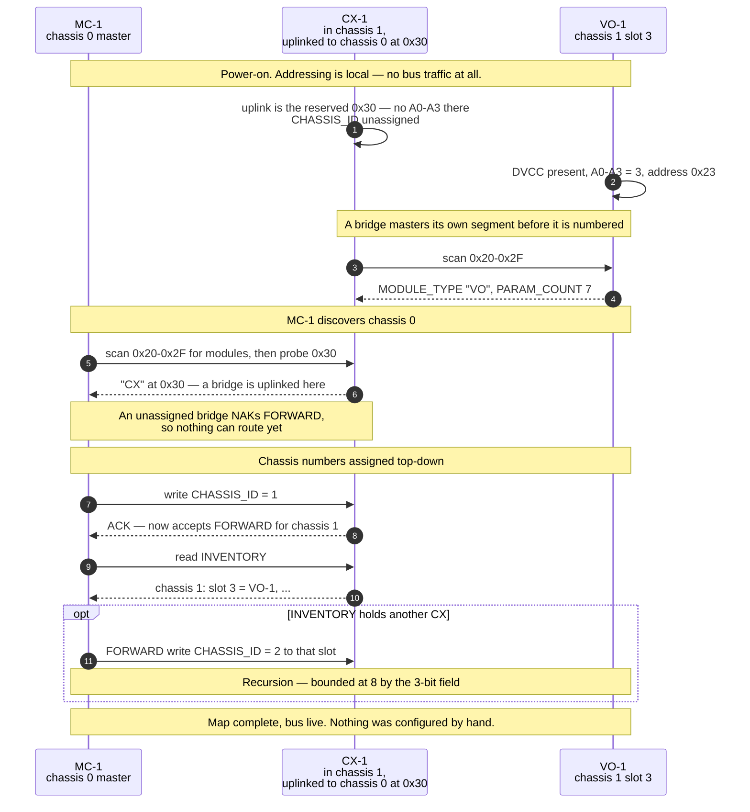
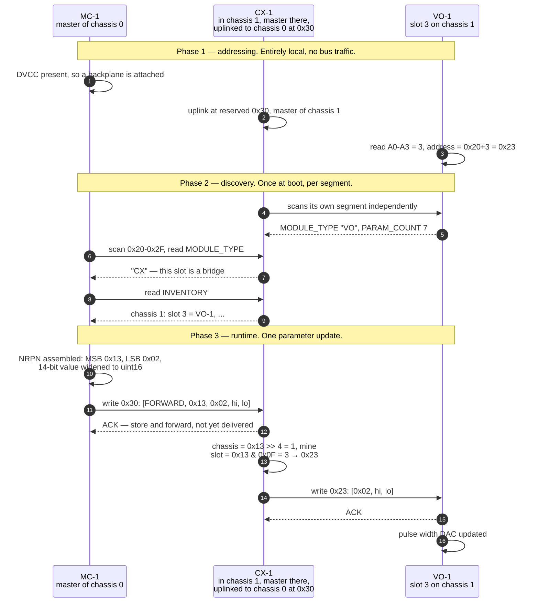
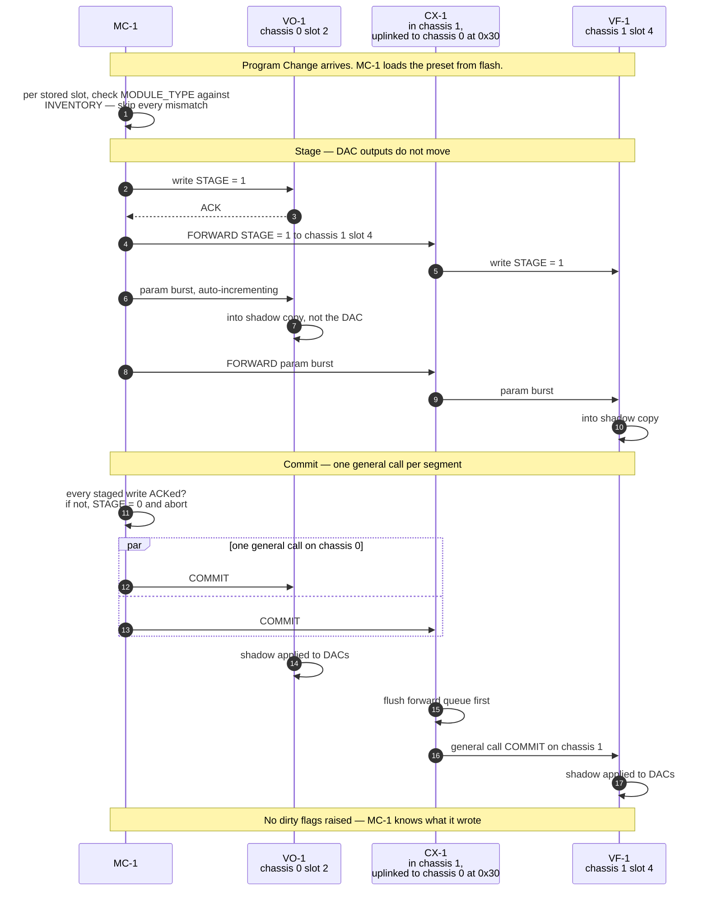

# FluxTron Inter-Module Bus Protocol

The digital backplane that carries parameter values between modules. Referenced
from `CLAUDE.md`; this file is the normative description.

MC-1 is the bus master. Every other module is a slave. Only *parameter values*
travel here — see the invariant below.

---

## 1. The invariant that everything else depends on

> **The bus may carry anything where tens of milliseconds of worst-case
> delivery latency is merely undesirable. It may never carry anything where
> that would be musically wrong.**

Pitch, gate, velocity, clock and audio stay on patch cables. That is what makes
a non-deterministic, clock-stretchable I2C link acceptable as the parameter
transport. Two reasons, and the second is the one people miss:

- **Latency is unbounded in the tail.** A normal transaction is ~400µs at
  100kHz, and worst case behind a burst is ~2ms. But an STM32 slave stretches
  SCL whenever it cannot service the peripheral, and a module writing its
  settings page stalls the CPU for **tens of milliseconds** during flash erase,
  because it is executing from the flash it is erasing. One module saving its
  MIDI channel would halt the entire bus.
- **A wire holds state; a bus carries events.** A gate on a patch cable cannot
  be "lost" — the voltage *is* the state. A note-on/note-off pair is two
  events, and a dropped note-off is a note that sustains forever. Recovering
  that needs retries, acknowledgements and an all-notes-off watchdog, all to
  recreate a property copper has for free.

**Note *number* as information is fine** — telling a module the current note so
it can display it, key-track slowly, or report to a host. It is the
*triggering* role that is forbidden, not the data.

**If a cable-free gate is ever wanted**, the standard Eurorack 16-pin bus
already carries CV and Gate lines, which PS-1's bus board routes. That is
analogue and deterministic. It is a single global pair, so mono only.

---

## 2. Electrical layer

| Property | Value |
|---|---|
| Transport | I2C, multi-drop, MC-1 as sole master per segment |
| DVCC (logic rail) | **5V**, sourced by PS-1's bus board |
| Speed | **100kHz** |
| Pull-ups | One ~2.2kΩ pair, **on the bus board only** |
| Connector | **2×6 (12-pin)** IDC, shrouded and keyed |

### Pinout

| Pin | Signal | Notes |
|---|---|---|
| 1 | DVCC (5V) | Pull-up reference, **not** a module supply |
| 2 | GND | |
| 3 | SDA | |
| 4 | SCL | |
| 5 | nRESET | Master-driven, open-drain. See §8 |
| 6 | ATTN | Slave-driven, open-drain, wired-OR. See §6 |
| 7–10 | A0–A3 | Slot address, driven by the backplane. See §3 |
| 11–12 | *spare* | Reserved |

### ⚠️ Do not use a 10-pin connector

Ten signals tempts a 2×5 header — the same family as the Eurorack power
header, same ribbon, same crimp tooling. **A 10-pin bus header beside a 10-pin
power header is an invitation to plug ±12V into the I2C bus**, which destroys
every MCU on the backplane. 2×6 physically cannot accept the power ribbon, and
the two spare pins cost nothing now and are impossible to add later.

### Pull-ups are singular, and live on the bus board

One 4.7kΩ pair per module across eight modules is ~590Ω in parallel, below the
~1kΩ floor the 3mA sink specification sets — nothing would pull the bus low.
Putting them on the bus board makes the count fixed regardless of how many
modules are installed, and leaves MC-1 electrically just another module.

### DVCC is 5V — settled

Chosen for **noise margin**, on a ribbon running the length of a case full of
switching supplies: VIL is 1.5V at 5V against 0.99V at 3.3V, roughly 50% more
margin in volts, and keeping 2.2kΩ rather than the 4.7kΩ that 100kHz would
also allow holds the bus impedance down, which helps again. Lower impedance is
the point, so **2.2kΩ is deliberate, not a current compromise**.

**Not chosen for lower current** — that intuition runs backwards. The
rise-time ceiling is voltage-independent (`tr` is measured 0.3·Vcc to 0.7·Vcc),
so both options face the same maximum pull-up; only the sink-current floor
moves. At any given resistor `I = V/R`, so 3.3V would draw *less*. At 250pF:

| | Valid pull-up range | Weakest legal Rp | Current when low |
|---|---|---|---|
| 5V @ 100kHz | 1.53k – 4.72k | 4.7k | 1.06mA |
| 3.3V @ 100kHz | 0.97k – 4.72k | 4.7k | 0.70mA |
| 3.3V @ 400kHz | 0.97k – 1.42k | 1.4k | 2.36mA |

Cost of 5V is 400kHz (see below — it does not matter) and an absolute-maximum
question when a module is unpowered, worked through next.

#### The unpowered-module case, assessed

Every I2C pin on the G0B1 is marked **FT**, so 5V tolerance holds in normal
operation. The residual is a different row: absolute-max VIN on an FT pin is
`VDD + 4.0V`, not a flat 5.5V, and ST lists positive injection on FT pins as
**0mA** — it is not a characterised condition.

**There is no power-up window.** An earlier revision of this file claimed one
on every power cycle, reasoning that 5V is necessarily up before any module's
VDD. That is wrong. DVCC and each module's LDO *input* are the same rail,
rising together, and the output follows the input during the ramp:

- While `V < 3.3 + dropout`: `VDD ≈ V − dropout`, so `VDD + 4 ≥ V` needs only
  `dropout ≤ 4V`. Always true.
- Once `V ≥ 3.3 + dropout`: `VDD = 3.3`, so the ceiling is 7.3V, above 5V.

`VDD + 4.0` therefore stays above DVCC throughout power-up.

**⚠️ Design rule that follows: the module 3.3V LDO must track its input** — no
long enable delay, no slow soft-start. A violation needs VDD held near zero
while the input is *already* at 5V, which only a delayed-start regulator
creates.

What remains is not a power-cycle property:

| Case | Sustained? | Note |
|---|---|---|
| Hot-swap | No | Eurorack convention is to power down first |
| 5V PTC trip / LDO failure | Yes | Module is already faulty |
| Bus ribbon on, power ribbon forgotten | Yes | Real bench scenario during bring-up |

All are capped at `5V / (2200 + 220) ≈ 2.1mA` by the pull-up — the only path
from DVCC to SDA/SCL, since every other device is open-drain and can pull only
*low*. **Latch-up cannot sustain on 2.1mA**, needing far more than a 2.2kΩ
resistor can deliver, so the failure mode self-limits. *(An earlier revision
put this at ~19.5mA, treating 5V as a stiff source at the pin. It is not.)*

Accepted knowingly: an out-of-absolute-max condition exists in fault and
bench-error cases, bounded and non-destructive.

### ⚠️ 5V DVCC costs 400kHz

### ⚠️ 5V DVCC costs 400kHz

At 5V the 3mA sink spec (VOL 0.4V) puts a **floor** of 1.53kΩ on the pull-up,
while rise time puts a **ceiling** of `300ns / (0.8473 × Cb)` at 400kHz. Those
cross at about **230pF**, above which no valid passive value exists. A
realistic 84HP segment is 150–250pF. 3.3V DVCC would have a 0.97kΩ floor and
keep 400kHz out to ~370pF.

**It does not bite.** With ATTN there is no round-robin polling load to spend
bandwidth on, and nothing else needs the headroom:

| Load at 100kHz | Cost | Verdict |
|---|---|---|
| One parameter write | ~400µs | Imperceptible |
| DIN MIDI at full rate (~347 CC/s) | ~14% duty | Comfortable |
| Preset recall, 8 modules | ~15ms | Invisible — it is all *staging*; the audible switch is the ~100µs broadcast commit |
| Firmware update, ~48KB | ~10s | Fine for a rare maintenance operation |

Firmware update is the only place 400kHz would help — roughly 10s against 3s —
and that is not worth designing around.

### Module-side requirements

- **Series resistors (~220Ω) on SDA and SCL** at each module's connector.
  Every module's 3.3V rail is derived *from* the 5V rail, so on **every power
  cycle** there is a window where the bus sits at 5V with pull-ups live while
  the MCU's VDD is still climbing from zero. The resistors limit injection into
  the pin ESD structures, and damp ribbon ringing besides.
- **⚠️ The 5V DVCC choice is under review — see the box below.** It may not
  survive the tolerance check.
- **ESD protection on SDA/SCL** per the range-wide protection standard.
- The inter-module bus and any local I2C peripheral must sit on **separate MCU
  I2C ports** (range-wide rule; the G0B1 has three).

---

## 3. Addressing

Two levels: **chassis** and **slot**.

### Slot comes from the backplane, not from the module

**Geographic addressing.** Each connector position on the bus board ties a
different pattern of `A0–A3` to ground; the module reads them as GPIOs at boot.
**Supersedes the DIP/jumper scheme** previously recorded in `CLAUDE.md`.

Better than DIP switches:

- **Duplicates become physically impossible.** Two modules cannot occupy one
  connector. A mis-set DIP gives an address clash that presents as a silently
  half-working bus.
- **Slot number *is* physical position.** MC-1 says "slot 3", you count three
  positions from the left.
- **Moving a module re-addresses it automatically**, including between chassis.

Better than the daisy-chained enable line the range doc previously flagged:
**there is no enumeration protocol at all.** Four GPIO reads at reset and the
module has a unique address. No unassigned-address state, no token passing, no
race if a module resets mid-enumeration, no recovery path to design.

Board area is roughly a wash — a 4-way SMD DIP is ~66mm², the extra connector
pins over a 2×2 are ~63mm² — so this deletes a user-configurable failure mode
for free.

**Implementation notes:**
- Module uses **internal pull-ups**; the backplane pulls down selectively.
- **Detect backplane presence via DVCC**, not via the address pins. A module on
  the bench with nothing plugged in reads all-ones, which is otherwise
  indistinguishable from a real position.

### Chassis costs a module nothing

A module never learns which chassis it is in. MC-1 addresses `(chassis, slot)`;
the bridge for chassis N strips the chassis field and forwards the bare slot
onto its local bus. Modules are genuinely chassis-agnostic.

**Nothing in the system is configured by hand — not even the bridge.** An
earlier draft here said CX-1's chassis number was "set once, where a jumper is
entirely reasonable". It does not need one, and that removes the last piece of
configuration anywhere in the design. See "Chassis numbers are assigned, not
set" in §4.

**Two modules in different chassis share an I2C address, and that is
intended.** Chassis 1 slot 3 and chassis 0 slot 3 both listen on `0x23`, each
having computed it from its own backplane's `A0–A3`. It is not a collision
because they sit on physically separate buses with separate masters — that
separation is the whole point of the bridge. From a module's point of view a
write from CX-1 is indistinguishable from a write from MC-1: it is simply its
master talking to it.

**Chassis identity is held by the bridge, never by the module.** MC-1 knows an
upstream event came from chassis 1 because it arrived via CX-1, not because
the module said so. That is what lets a module move between cases and work
unchanged.

### I2C addresses

`I2C address = 0x20 + slot`, so **0x20–0x2F**. Clear of the reserved ranges
(0x00–0x07, 0x78–0x7F). Because each chassis has a private address space, only
16 addresses are ever consumed, leaving most of the I2C space free.

**A bridge's uplink sits at a reserved `0x30`, outside the slot range.** It
arrives on its parent's bus by cable rather than by backplane position, so it
has no `A0–A3` to read there and no slot to occupy. A fixed address works
because the topology is daisy chain only (§4), so there is never more than one
bridge per segment — and because segments have private address spaces, **the
bridge is always at `0x30` on the segment above it**, whichever chassis that
is. Still no configuration: the address is fixed by this document, not set.

### Why 16 slots is enough

Not arbitrary — **I2C's own 400pF bus capacitance limit caps a segment at
roughly 16 modules**, before the 4-bit slot field does:

| Modules on a segment | Approx. Cb | |
|---|---|---|
| 16 | 210–290pF | comfortable |
| 26 | 330–440pF | at or over the limit |
| 32 | 400–580pF | not a working bus |

(~10–15pF per module of pin, connector and stub, plus ~50pF/m of ribbon.)

Physical positions: 84HP = 10, 104HP = 13 — both fit. A 6U or 2×104HP case is
20–26 positions and wants **two segments with a bridge**, which is what
capacitance demands anyway. The two constraints agree.

Going to 5 bits would cost only one spare connector pin, but would buy address
space that cannot be physically populated.

Total system capacity is 8 chassis × 16 slots = **128**, the full NRPN MSB
space — around 80 modules across 672HP.

---

## 4. Multi-chassis: bridge, not buffer

The chassis extension module (**CX-1**) has **two bus ports**:

| Port | Connects to | Role |
|---|---|---|
| **Local port** | Its own chassis's backplane, ordinary 12-pin bus connector | **Master** of that segment |
| **Uplink port** | The parent chassis, by cable, PCA9615 differential pair | **Slave** on the parent's bus |

**CX-1 lives in the chassis it brings onto the bus** — the downstream one, not
the parent.

**Rejected: a transparent buffer** making one logical bus across all chassis.
It leaves a single flat address space — every module in the system needing a
globally unique setting, with a ledger of which case got which range, and
re-jumpering whenever a module moves. Capacitance and fanout also keep
accumulating, and a fault anywhere takes down everything.

The bridge gives each segment private addressing, bounded capacitance, and
fault containment. **It needs no new architecture**: the range-wide rule that
the bus and local peripherals sit on separate I2C ports means the standard
STM32G0B1 is already a two-port device. CX-1 is that part with a different
firmware personality.

**Topology is a daisy chain**, and it falls out for free: the bridge is
addressed like any other module on its parent's bus. Traffic for chassis N+1
goes to the bridge's slot address on chassis N's bus, which re-emits it
downstream. Recursion, no special routing.

- **MC-1 discovers the bridge** by scanning and reading identity registers for
  module type `CX`. An earlier draft reserved slot 15 for it; that does not
  work with geographic addressing, since the bridge occupies whatever physical
  position it is plugged into.
- Each downstream chassis needs its own PS-1 — the inter-chassis link carries
  only differential I2C plus a ground reference, **never power**.
- **The bridge aggregates a summary dirty bitmap** — which slots below it have
  pending events — so MC-1 does one read per *chassis*, not per module.
  Without this, upstream cost grows with system size.
- **Writes are store-and-forward; reads are served from a cache.** A
  synchronous read through a store-and-forward bridge would need it to
  clock-stretch for the whole downstream transaction — tolerable at one hop,
  not at two, against the ~1ms ceiling in §10. Since the bridge already polls
  downstream dirty bitmaps to build its summary, it **shadows the downstream
  parameter values** and serves reads from that synchronously, in one
  transaction. Worst case 16 slots × 128 params × 2 bytes = 4KB, realistically
  ~512 bytes, against the G0B1's 144KB of RAM. A read across a bridge then
  costs the same as a local one.
- **⚠️ The bridge needs a transparent pass-through mode** for firmware
  updates. Bootloader traffic uses a fixed address that protocol-aware
  forwarding will not recognise.

### Chassis numbers are assigned, not set

CX-1 is a slave on its parent's bus and already holds a unique address there,
taken geographically from the backplane. So the parent can reach it *before*
it knows its chassis number, and simply tell it:

1. MC-1 is chassis 0 by definition — it is the root master.
2. MC-1 scans chassis 0 and finds a module reporting `MODULE_TYPE` `CX`.
3. MC-1 writes `CHASSIS_ID = 1` to it. That bridge now accepts `FORWARD`
   packets whose chassis field is 1, and passes anything higher downstream.
4. MC-1 reads that bridge's `INVENTORY`. If it holds another `CX`, MC-1
   assigns it chassis 2 — by tunnelling the write through the bridge it has
   just configured.

The recursion is bounded by the 3-bit chassis field at 8.

**This works where general I2C auto-addressing does not**, because the
chicken-and-egg problem is absent: auto-addressing modules is hard because you
need an address to assign an address, and CX-1 already has one. Assigning the
chassis number is an ordinary register write to a device the master can
already reach.

Two properties held deliberately:

- **`CHASSIS_ID` is volatile and reassigned at every discovery.** Never
  persisted. Moving a case to a different position in the chain then just
  works, with no stale state to go wrong, and a bridge must accept
  reassignment.
- **Numbering follows physical chain order** — first case downstream is 1,
  the next is 2. More intuitive than a jumper, which has to be read off the
  board to find out.

A bridge boots **unassigned** and must NAK or ignore `FORWARD` until it has an
ID. It may scan its own segment immediately, since `INVENTORY` does not depend
on the number.

**⚠️ Daisy chain only.** Two bridges on one segment is a tree, and the routing
rule ("chassis higher than mine → downstream") cannot say *which* downstream.
MC-1 must report that as an error rather than half-work.

### Startup: addressing, discovery and chassis assignment

**Rediscovery runs on a slow timer, not once.** Modules do not necessarily
boot before the master, so a NAK means "absent for now" rather than "absent".
A bridge accepts reassignment of `CHASSIS_ID` on every pass.

### Where CX-1 physically lives

**CX-1 lives in the chassis it brings onto the bus.** An 8HP module in
chassis 1, powered by chassis 1's PS-1, with its local port plugged into
chassis 1's backplane and its uplink cabled to chassis 0.

So it *is* connected to both chassis — through two different ports, which is
the point of having two. Earlier drafts of this section said CX-1 "is not
plugged into both", which was true only of backplanes and obscured the
topology rather than describing it.

| | |
|---|---|
| **CX-1, in chassis 1** | Local port: standard 12-pin bus connector into chassis 1's backplane, mastering that segment. Uplink port: panel RJ45 through a PCA9615, cabled to chassis 0. Slave at `0x30` on chassis 0's bus. |
| **Chassis 0's bus board** | A **downstream link port** — PCA9615 plus connector — terminating that cable. Every PS-1 bus board carries the footprint; populate it only when the chassis chains further. |

**The bridge cost lands in the new chassis, not the existing one.** Adding a
case should not consume a slot in a case that is already full. N chassis needs
N × PS-1 and (N−1) × CX-1, with each CX-1 in its own chassis: chassis 0 holds
MC-1 and PS-1, every chassis after it holds PS-1 and CX-1.

*Rejected: seating the bridge in the parent chassis.* It forces the bridge to
take a geographic slot in a case that may have none free, and charges the cost
of expansion to the wrong box. The reserved `0x30` uplink address removes the
only reason to have preferred it.

*Rejected: two CX-1s per link, back to back.* It would make every bus board
identical, but costs 16HP per link instead of 8HP.

Two questions to settle when CX-1 is actually specced, neither blocking:

- **The panel connector wants to be RJ45/Cat5**, so the two differential pairs
  get real twisted pairs. Electrically right, aesthetically industrial against
  a matte-black etched panel — a genuine tension at panel design.
- **⚠️ The inter-chassis ground is a parallel path.** Two cases with separate
  bricks are already bonded through the shields of any patch cables running
  between them, so the link's ground reference adds a loop — and audio *will*
  run between those cases. Galvanic isolation on the link would break it but
  needs an isolated supply on one side. Think about it before the link is
  designed, not after.

### How a parameter update crosses a bridge

**The addressing phase never reappears.** By the time any parameter moves,
every module already knows its address, and nothing on the wire carries slot
assignment. The bridge's translation is pure arithmetic on the chassis field —
it never needs to know how slots got their numbers. That decoupling is the
main practical argument for geographic addressing over any enumeration scheme:
there is no addressing state to keep coherent across a bridge.

**The tunnelled payload is the NRPN address verbatim.** Because chassis and
slot are packed into the NRPN MSB byte, MC-1 forwards `[MSB, LSB, hi, lo]`
without re-encoding anything. A bridge one level further down receives the
same four bytes and applies the same test, so the recursion needs no depth
field and no routing table.

**⚠️ Bridges are store-and-forward, and ACK before delivery.** A downstream
NAK — a module absent or wedged — therefore cannot propagate back
synchronously. Clock-stretching through the hop would fix that, but at 100kHz
a downstream write is ~400µs and each further hop adds as much, which breaks
the ~1ms stretch ceiling in §10. So delivery failures are reported
asynchronously via `FWD_STATUS`, surfaced through the bridge's dirty bitmap
and ATTN like any other event.

Latency is one transaction per hop: about 850µs to chassis 1, 1.3ms to
chassis 2. Both are comfortably inside the §1 invariant, which is exactly why
the invariant is what makes multi-chassis tolerable at all.

---

## 5. Register model and transactions

Standard register-pointer model, so the bus is debuggable from a Pi with
off-the-shelf tools.

| Range | Meaning |
|---|---|
| `0x00–0x7F` | Module parameters (matches the NRPN LSB range exactly) |
| `0x80–0xFF` | System registers |

- **Write:** `[reg, val_hi, val_lo]`, with `reg` auto-incrementing on longer
  payloads — one transaction per module for a preset recall.
- **Read:** write `[reg]`, repeated START, read 2 bytes (auto-incrementing).
- **Values are always uint16, full scale**, whatever the parameter means. The
  module owns the mapping into its own DAC. Booleans use 0 / 0xFFFF; enums use
  small integers.
- **Big-endian on the wire**, matching MIDI's MSB-first convention.

### System registers

| Reg | Name | Access | Notes |
|---|---|---|---|
| `0x80` | `MODULE_TYPE` | R | Two ASCII chars, e.g. `'V','O'` |
| `0x81` | `MODULE_NUMBER` | R | The `-1` in `VO-1` |
| `0x82` | `PROTOCOL_VERSION` | R | This document's revision |
| `0x83` | `FW_VERSION` | R | |
| `0x84` | `PARAM_COUNT` | R | How much of `0x00–0x7F` is real |
| `0x85` | `CAPABILITIES` | R | Bitfield |
| `0x86` | `STATUS` | R | Busy, calibrating, error |
| `0x87` | `DIRTY` | R | 32-bit bitmap, two registers |
| `0x88` | `COMMAND` | W | Identify, calibrate, clear error |
| `0x90` | `STAGE` | W | Preset staging, §7 |
| `0x9F` | `ENTER_BOOTLOADER` | W | Magic value only, §8 |
| `0xA0` | `FORWARD` | W | **Bridge only.** Tunnelled write, §4 |
| `0xA1` | `INVENTORY` | R | **Bridge only.** What the downstream segment holds |
| `0xA2` | `FWD_STATUS` | R | **Bridge only.** Queue depth *and* delivery errors, §10 |
| `0xA3` | `CHASSIS_ID` | R/W | **Bridge only.** Assigned at discovery, §4. Volatile |

**`FORWARD` is the one write that is not `[reg, hi, lo]`** — its payload is
`[reg, addr_msb, param, hi, lo]`, carrying the NRPN address byte verbatim.
System registers may define their own shapes; parameter registers may not.

### Broadcast

I2C **general call** (address `0x00`), with our commands at second byte
`0x10`+ to stay clear of the spec's own `0x04` and `0x06`. The STM32 slave
supports this via `GCEN`. Used for preset commit and panic.

*(Alternative considered: the G0's second address register with masking, which
would let a module answer a broadcast address in hardware. General call is
simpler and purpose-built; OA2 masking stays available if needed.)*

---

## 6. Upstream events: dirty bitmap, not a FIFO

Panel encoders move parameters locally. MC-1 needs to know, so a host can
record or reconcile — MC-1's USB link is the only path a panel move has to the
outside world.

A module sets a bit in `DIRTY` per changed parameter and asserts **ATTN**.
MC-1 reads the bitmap, then reads the flagged parameters.

**A bitmap cannot overflow — it coalesces**, which is exactly right for a knob
being turned, where a FIFO would drop events or back up. ATTN removes the
round-robin poll entirely; a fallback slow poll (~1Hz) covers a missed edge.

**Two rules that prevent feedback loops:**
- MC-1's shadow updates on read, and it never re-writes a value it just read.
- **A preset commit does not raise dirty flags.** MC-1 knows what it wrote.

MC-1 should also **coalesce downstream**: keep a shadow of every parameter and
push changes on a fixed tick, so a DAW automation sweep cannot storm the bus.

---

## 7. Presets

**Presets live in MC-1, not in the modules.** A preset is a property of the
*rack*, not of a module.

Rejected: per-module preset storage with a broadcast "recall preset 5". It
needs almost no bus traffic, but a module carries its own idea of preset 5
between racks, saving means every module writes flash — the exact clock-stretch
hazard of §1 — and backing a preset up over USB means reading it all back
anyway.

**Presets are not settings.** The existing settings store (module flash, per
`CLAUDE.md`) keeps things tied to the *hardware*: VO-1's calibration constants,
MC-1's MIDI channel and clock division. Those are never part of a preset.

### Recall: stage, then commit

The whole reason this is in the protocol from the start. Writing parameters one
at a time and applying each immediately makes the rack audibly sweep through
intermediate states — a filter opening, a pitch gliding — on what should be an
instant change.

1. MC-1 writes `STAGE = 0x0001` to each populated slot. Parameter writes now
   land in a **shadow copy**; DAC outputs do not move.
2. MC-1 writes the parameters, one auto-incrementing burst per module.
3. MC-1 issues a **general-call COMMIT**. Every module applies its shadow
   simultaneously.

The broadcast is what makes this worth doing: a whole segment switches in
**one I2C transaction**, instead of tens of milliseconds of visible sweep.

Two requirements fall out of the multi-chassis case, and neither is optional:

- **⚠️ A bridge must forward general calls.** A general call reaches only the
  segment it was issued on, so without this a downstream chassis stages a
  preset and never commits it — the worst possible failure, since the rack
  would be half-switched.
- **⚠️ A bridge must flush its forward queue before re-emitting the commit.**
  Writes are store-and-forward, so staged values may still be queued when the
  commit arrives. Committing first would apply a shadow that is not yet
  complete.

**Skew across a bridge is one hop, not zero.** Within a segment the switch is a
single transaction; a downstream chassis follows about 400µs later per hop at
100kHz. Inaudible for a preset change, but the "one transaction" property is a
per-segment guarantee, not a system-wide one.

- `STAGE = 0x0000` **aborts** and discards the shadow.
- **Staging auto-aborts after ~1 second** with no commit, so a master that dies
  mid-recall cannot leave modules staged forever.
- **MC-1 verifies staging before committing, in two parts.** Locally, every
  write must have ACKed. **Across a bridge that is not sufficient** — the ACK
  came from the bridge, not the module (§4) — so MC-1 must also wait for each
  bridge in the path to drain and then confirm `FWD_STATUS` reports no
  delivery errors. If either check fails, write `STAGE = 0` and abort rather
  than commit a partially-updated rack.
- Panel encoders keep working during staging; the commit simply wins. Staging
  windows are short enough that freezing the panel would be worse.

### ⚠️ Type-check every slot on recall — this is a safety requirement

A preset records the **module type per slot**. If a preset saved with VO-1 in
slot 2 is recalled into a rack with VF-1 there, MC-1 must **skip that slot**.
Writing VO-1's pulse-width value into whatever a filter keeps at the same
register is not a cosmetic bug; it sets an unrelated parameter to an arbitrary
value. Mismatches are reported, never guessed at.

### Save

MC-1 reads all parameters from each populated slot — one auto-incrementing
burst per module, length from `PARAM_COUNT` — and writes its own flash.

**⚠️ MC-1 must run its flash routines from SRAM**, or defer saves until no note
is sounding. A G0 page erase stalls a CPU executing from flash for tens of
milliseconds, and MC-1 is generating V/OCT and gate.

### Format and capacity

Variable length, storing only populated slots: a per-slot header of chassis,
slot, module type and parameter count, then the values. A typical 8-module rack
at ~8 parameters each is around 160 bytes.

**Program Change recalls a preset**, which is what a DAW will send anyway.
Save has no MIDI equivalent, so it is a system command (§9).

Exact flash budget, preset count and any wear-levelling are MC-1 implementation
details, not protocol. Note that flash endurance is ~10k cycles.

---

## 8. Firmware update over the bus

`CLAUDE.md` records that MC-1 can reflash any module using the STM32's I2C
system bootloader. That pulls three things into the protocol:

- **`ENTER_BOOTLOADER` takes a magic value, never a bare flag.** A module that
  jumps to the bootloader by accident goes dark until power-cycled.
- **The bootloader uses a fixed I2C address**, not the slot address, so **only
  one module can be in bootloader mode at a time**. MC-1 sequences reflashing
  strictly one-by-one.
- **Confirmed against AN2606's STM32G0B1xx/0C1x table: either I2C1 or I2C2
  may be used.** The pin set *within* each peripheral is fixed — no alternate
  AF mappings — but there is a choice of peripheral. *(An earlier revision of
  this file said the bootloader was I2C1 on PB6/PB7 only, "fixed, not
  remappable". That came from a community report about the G030 and was
  over-generalised; the G0B1 has more options.)*
- **Consequence: local peripherals go on I2C3.** The G0B1 has three I2C ports
  and the range-wide two-port rule needs the inter-module bus separate from
  the AS1115 / MCP4728 / AD5693R. I2C3 is the port that is *not*
  bootloader-capable, so spending it on locals leaves both qualifying ports
  free for the bus — the bus then takes whichever of I2C1/I2C2 routes better,
  rather than being pinned to one peripheral before layout starts.
- **Bootloader pins, from the same table:**

  | Peripheral | SCL / SDA |
  |---|---|
  | I2C1 | **PB6 / PB7** |
  | I2C2 | **PB10 / PB11** |

  Both are on port B and both are bonded out on LQFP-48, so the choice is
  genuinely free. **Pick one and use it on every module**: uniform firmware
  and layout are worth more than per-module optimisation.
- **Bootloader address: 7-bit `0x5D`** (`0b1011101x` — `0xBA` write, `0xBB`
  read). Clear of the `0x20–0x2F` slot range. **Both I2C1 and I2C2 use the
  same address**, so the one-module-at-a-time constraint holds whichever
  peripheral the bus takes. Bootloader config is target mode, 7-bit
  addressing, analog filter on, up to 1MHz — the bootloader itself is not a
  speed constraint.

### ⚠️ AN2606 bootloader limitations that shape the update flow

Four are documented against this bootloader. Three change what we do:

- **The `Go` command disables the debug access port** — it writes a wrong
  value to `FLASH_ACR`'s `DBG_SWEN` bit when jumping to the application.
  **So never use `Go`. Start the application with nRESET instead.** Cleaner
  regardless, since the module starts from a known peripheral state, and it
  sidesteps the bug entirely. This is the second independent reason nRESET
  earns its pin.
- **Multi-sector erase is broken on Bank2** — a wrong BUSY-bit check raises a
  FLITF error after the first sector. **Workaround: erase one sector at a
  time when targeting Bank2.** Conditional: at 128KB (`CB`) there is probably
  no Bank2, since dual-bank is a feature of the larger G0B1 flash variants.
  **Confirm before any module moves to a bigger part — MC-1 is the likely
  candidate, since it stores the presets.**
- **⚠️ The Empty-check flag is cleared during bootloader startup.** The
  bootloader's own deinitialization writes the default to `FLASH_ACR`, zeroing
  the Empty-check bit. So a module that booted to the bootloader *because* its
  flash was empty will, **on a subsequent reset, try to boot the empty flash
  and crash.**

  This interacts badly with a shared nRESET. A module interrupted mid-reflash
  — erased but not yet programmed — boots to the bootloader via empty check,
  which is what we want; but asserting the backplane's nRESET for any reason
  then crashes it, because nRESET resets *every* module.

  Two rules:
  - **Never assert nRESET while any module is mid-update.** The reset that
    exits the bootloader comes strictly after programming completes.
  - **Do not rely on empty check as the recovery path.** The BOOT0 jumper is
    deterministic regardless of flash state, which makes it more important,
    not less.

  The application note's own wording closes this off: *"Avoid using reset on
  this case. If the system crashes, an option byte change or POR is needed to
  reboot."* **An nRESET pulse is not a POR**, so the backplane's reset line
  cannot recover a module crashed this way — only actually removing power can.
  That is survivable in a rack you can switch off, but it is the reason the
  BOOT0 jumper exists rather than a cleverer bus-driven mechanism.
- **⚠️ Reported erratum: the I2C bootloader hangs if PA3 stays low**, needing a
  pull-up on PA3. If PA3 is used for anything that idles low, reflash-over-bus
  fails silently. Reported against bootloader v5.2 on a G030, so **check
  whether it applies to the G0B1's bootloader version** before designing the
  pull-up in — it is cheap insurance either way.
- **nRESET is what makes the feature survive a bad flash.** A software
  "enter bootloader" command can only be delivered while the application is
  still running — precisely not the case when reflashing is most needed. Without
  a hardware path, a bricked module is unreachable and you are back to pulling
  modules and hunting for SWD pads, which is the thing the feature exists to
  avoid.
- **BOOT0 is a per-module jumper, not a bus line.** A shared BOOT0 would put
  every module into the bootloader at once, all answering on the same fixed
  address. Since only one module can be in bootloader mode anyway, a jumper
  fits the constraint rather than fighting it: set it on the board being
  recovered, assert the shared nRESET, and that module alone comes up in the
  bootloader while the rest boot normally. nRESET is also the way *out* of the
  bootloader in the normal software-jump flow.

**⚠️ Layout constraint** (also in `CLAUDE.md`): the inter-module bus must land
on a **bootloader-capable I2C peripheral and pin set**, per AN2606, or the
whole feature is lost. Free if designed in, impossible to retrofit.

---

## 9. MIDI mapping

NRPN's structure maps onto the two-level bus address with **zero translation**,
which is the main reason to prefer it over a flat CC map.

| MIDI | Meaning |
|---|---|
| NRPN MSB (CC 99) bits 6:4 | chassis 0–7 |
| NRPN MSB (CC 99) bits 3:0 | slot 0–15 |
| NRPN LSB (CC 98) | parameter register `0x00–0x7F` |
| Data Entry MSB/LSB (CC 6/38) | 14-bit value |
| Data Increment/Decrement (CC 96/97) | nudge by one step |

The NRPN LSB range and the module parameter range are the same 0–127 by
construction, so the LSB *is* the register number.

**CC 96/97 are a real bonus**: they are the standard relative-control messages,
which is exactly the semantic this range already has in hardware, since every
control is an incremental encoder.

- **14→16-bit widening is `(v << 2) | (v >> 12)`** — exact at both endpoints,
  one instruction.
- **`NRPN MSB = 127` is reserved for system commands** addressed to MC-1
  itself: preset save, preset recall, panic, identify, bus rescan, enter
  bootloader for slot N. It costs one slot in a chassis nobody will build.
- **Program Change recalls a preset.**
- **MIDI channel selects the voice chain**, i.e. which MC-1, consistent with
  the existing daisy-chain design.

**MC-1 is a MIDI decoder, not a MIDI repeater.** It runs the NRPN state machine
and pushes clean `(slot, register, value)` triples. Slaves never see MIDI
semantics, so adding a second control surface later touches no module firmware.

### ⚠️ Why coarse and fine tune are separate parameters

14 bits over ±5V is ~0.7 cent per step, which is audible on a sustained note.
VO-1's TUNE and FINE being separate parameters is not only ergonomics — it is
what gets the resolution under one cent. Any future parameter needing better
than 14 bits must split the same way.

---

## 10. Discovery, errors and recovery

- **At power-on MC-1 scans `0x20–0x2F`** and reads `MODULE_TYPE` from each
  responder, building the map dynamically. Its firmware never needs rebuilding
  for a given rack layout.
- **Scanning retries.** Modules do not necessarily boot before the master;
  rediscovery runs on a slow timer rather than once at startup.
- **A missing module NAKs.** MC-1 marks the slot absent and retries on the
  rediscovery timer, not on every transaction.

### Acknowledgement model

An ACK means different things in three places, and conflating them is how a
rack ends up half-updated. Collected here because the rules otherwise sit in
§4, §5 and §7.

| Transaction | What an ACK proves |
|---|---|
| Write to a module on the master's own segment | The module received it |
| Write tunnelled through a bridge (`FORWARD`) | **Only that the bridge accepted it.** Bridges are store-and-forward and ACK before delivery, so this says nothing about the module |
| General call (broadcast) | **Nothing useful.** I2C wired-ANDs the ACK, so the master cannot tell which devices responded — and across a bridge there is no ACK path at all |

Consequences:

- **Delivery across a bridge is confirmed asynchronously or not at all.**
  `FWD_STATUS` carries both a queue-depth/busy indication and an error flag.
  Both are needed: without the queue depth, a caller cannot distinguish
  "nothing has failed" from "nothing has been attempted yet".
- **A broadcast is inherently unverifiable**, which is exactly why the
  pre-commit verification in §7 carries the weight. The commit itself cannot
  be checked, so everything must be known-good before it is issued.
- Clock-stretching the bridge to make a tunnelled write synchronous was
  rejected: at 100kHz one hop is ~400µs and each further hop adds as much,
  against the ~1ms stretch ceiling above.
- **Bus recovery**: if SDA is stuck low, the master issues 9 clock pulses to
  free it. Each module runs an I2C watchdog that resets its own peripheral if
  the bus has been stuck beyond a few hundred milliseconds.
- **Clock stretching is bounded by design rule**, not by hope. No slave may
  stretch beyond ~1ms. Flash writes run from SRAM or with the peripheral
  disabled.

---

## Open items

- Verify the G0B1's I2C pin 5V tolerance, with VDD off, against the datasheet.
- Confirm the STM32G0 I2C bootloader address and pin set against AN2606.
- `CAPABILITIES` and `STATUS` bitfield definitions.
- CX-1 is specified here only as far as the protocol requires; it has no module
  folder yet and is not in phase 1 scope.
- Whether `PROTOCOL_VERSION` mismatch should refuse or degrade.
